+++
title = 'Introducing: Mitty'
date = 2024-08-14T09:05:38-05:00
draft = false
+++

<h1 style="text-align:center">A Github Commit Bruteforce Tool used to find deleted or dereferenced commits!</h1>


<div style="text-align:center">
    
    <br>
    <h1><a href="https://github.com/e-nzym3/mitty"> --> Get Mitty Here <--</a></h1>
</div>

The recent Defcon 2024 conference in Las Vegas hosted a Cloud Capture-The-Flag (CTF) event in which I participated with several of my work colleagues. I took on a couple of Git-related challenges as I never really interacted with Git from a CTF perspective but figured this would be a great way to learn more about Git and Github.

One challenge, titled [“Dungeon of Leaked Treasures”](https://github.com/cloud-village/DC32-Dungeon_of_leaked_treasure) stumped me. I spent, no joke, around 8 hours on this thing and it was only worth 500 points (meaning it was not supposed to be that challenging). There were two teams which solved the challenge so I knew that there had to be a way to solve it, but nothing I tried worked.

Ultimately, after the CTF has concluded, it was confirmed that what I was doing to solve the challenge should have worked but the organizers, unfortunately, misconfigured the challenge making it unsolvable via the intentional method. So, I contacted one of the members of the team that solved this challenge and they kindly shared with me that they solved it by finding a commit on the challenge’s repo that had the flag exposed. (!!!)

I realized that the only way to get to that commit would have been to brute force my way to it. Luckily, I recently read a [Truffle Security](https://trufflesecurity.com/blog/anyone-can-access-deleted-and-private-repo-data-github) article which talked about accessing “deleted” commits. Long story short, **Github pretty much does not delete anything, it simply “dereferences” it**. What that means is that if we have the correct commit hash, we can still access it via the https://github.com/<user>/<repo>/commit/<commit_hash> URL. Better yet, commits can be access via the short SHA-1 hash. All that’s needed to access a commit is the first 4 characters of the hash. For instance, if your commit hash is **“155cee593ec4a9c98cfcc8218b3ea97428366bd8”** you can access it via **“155c“**. Well, bruteforcing 4-characters is certainly way more feasible than bruteforcing 40-characters.

Now, bruteforcing 4-characters still requires sending 65,536 HTTP requests to Github, and Github will not like that. You will be hit with rate limiting very quickly. So how do we get around this? Well, how about we spread out our requests over several source IPs instead?

So with that information in hand, I figured I would automate this process and created **Mitty**.

<hr style="height: 2px">

## Overview of Mitty

**Mitty** (because “commit”, and github’s logo is a cat, and cat = kitty = mitty, just a perfect name is all, if I may say so myself) automates the discovery of commit hashes. It does so by routing all of its requests through AWS API Gateways which are stood-up automagically thanks to the implementation of [FireProx](https://github.com/ustayready/fireprox) code. However, this does mean that AWS Console credentials will be required for you to run this tool. I will cover the necessary configuration later in this post.

### Usage

I tried to keep the tool minimal without too many required arguments. With that said, there are two which are required for conducting any type of operation with Mitty and those are **“-k”** for AWS Access Key and **“-s”** for AWS Secret Access Key. These two parameters will allow Mitty to authenticate to AWS and manage your AWS API Gateways. Below is a full **“-h”** output from Mitty:

```
usage: Mitty [-h] [-t REPOSITORY] -k KEY -s SECRET [-r REGION] [-n COUNT] [-c] [-m MATCH]

A command-line tool for brute-forcing commit IDs via FireProx.

options:
  -h, --help            show this help message and exit
  -t REPOSITORY, --repository REPOSITORY
                        The target GitHub repository in the format "USER/REPO" (e.g., e-nzym3/mitty)
  -k KEY, --key KEY     AWS key for FireProx
  -s SECRET, --secret SECRET
                        AWS secret key for FireProx
  -r REGION, --region REGION
                        AWS region to deploy gateways in (default = us-east-1)
  -n COUNT, --count COUNT
                        Number of concurrent streams use (default = 5)
  -c, --cleanup         Cleanup APIs from AWS
  -m MATCH, --match MATCH
                        Comma separated list of words to look for in commit pages (e.g., "key,secret,password")
```

### Example Run

<div style="text-align:center">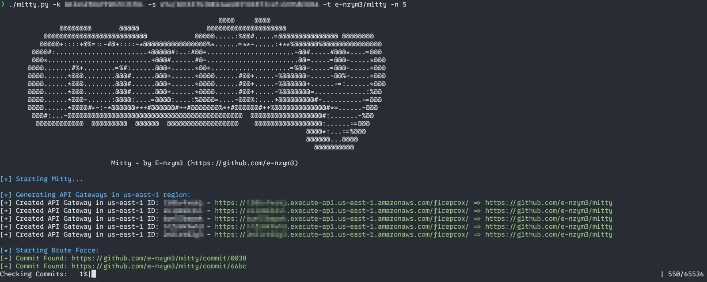</div>

The screenshot above shows a sample run that spawned 5 AWS API Gateways through which all requests are routed, granting us the ability to rotate our source IPs, thus preventing the Github rate limiting issue. All found commits are printed out to the console as well as a log file which is created locally.

*Note: the tool will find ALL commits, not just deleted/dereferenced ones. Parsing between the two will be included in future releases of Mitty.*

## AWS Credentials Requirement

As previously mentioned, we will need an AWS account for creating our AWS API Gateways. After we create one, we will have to configure credentials for authentication with Mitty.

*Note: the following sections are applicable as of the time of publishing this blog post. In the future, menus may move around, rules may change.*

### Creating AWS Account

To create an AWS account, simply follow the prompts starting at [here](https://signin.aws.amazon.com/signup?request_type=register).

Amazon may ask you for a credit card to validate your account and to keep it on file for any charges. This is pretty normal even though you are signing up for the free tier. However, there is something to keep in mind. If you are going to send a lot of requests through the API Gateway service, they may charge you for it. *(I believe the free limit is around a million requests or so).*

The charges that I have incurred over my whole pentesting career of using FireProx with API Gateways for password spraying must be under $4. The most I’ve ever been charged in a month was $0.34, and that was during a heavy week of spraying. So just an FYI.

### Creating Authentication Credentials

Now we will need to perform some configuration with AWS’ IAM service to configure ourselves a set of credentials to use with Mitty. Start by logging into https://console.aws.amazon.com/.

Once you are inside the AWS Portal, go to the search bar located at the very top of the page and simply search for **“IAM“**. The IAM service should be listed as our top result. Go ahead and click on it.

<div style="text-align:center">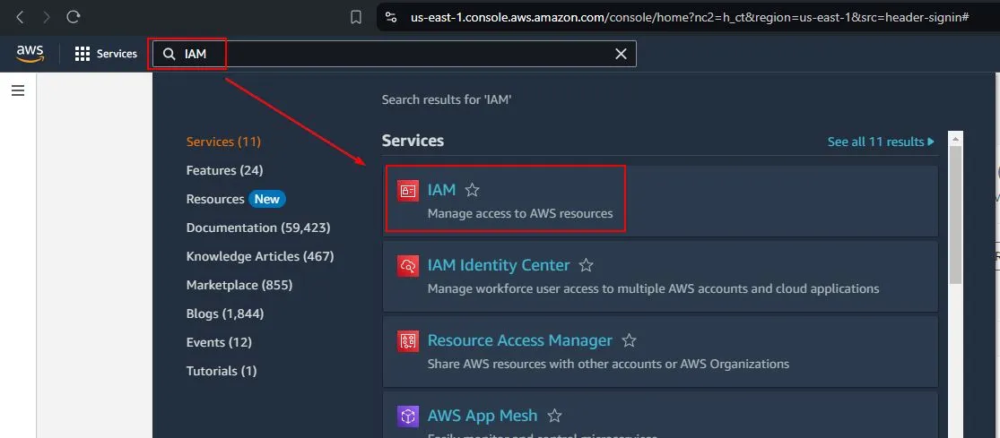</div>

Once you reach the IAM Dashboard, browse to the **“User groups”** option under **“Access Management”** on the left side of the page.

<div style="text-align:center">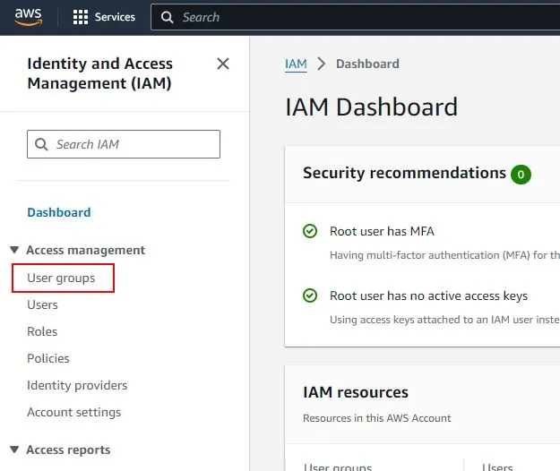</div>

Then, locate the orange button that says **“Create group“**, should be in the right upper corner area.

Within the **“Create user group”** page, we will want to fill out the following sections:

1. User group name – self-explanatory, you can name it anything, I named mine **“Mitty“**
2. Attach permissions policies – here you will use the search bar and search **“AmazonAPIGatewayAdministrator“**. Hit the checkbox next to the policy’s name to attach it to the group.

Once you’re done with the above, click the orange **“Create user group”** button in the right-lower corner of the page.

<div style="text-align:center">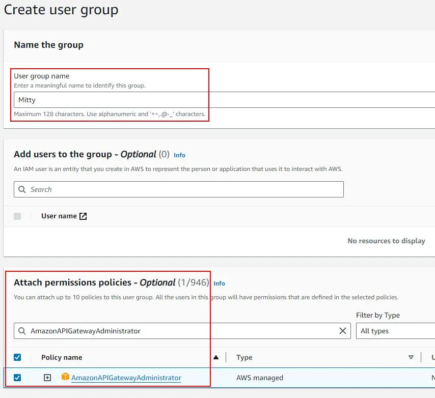</div>

You should see a green runner on the top of the page that states the group was created. You should also see the group on the current page you are on.

Next, let’s create the user that we will use for authentication against AWS. Under **“Access Management”** on the left side of the page, select **“Users“**.

<div style="text-align:center">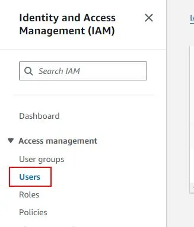</div>

On the **“Users”** page, hit the orange **“Create user”** button in the right-upper corner of the page. The first prompt will ask for a user name, assign it whatever you wish, I went with **“MittyTool“**. Also, do not select the **“Provide user access to the AWS Management Console”** box as it is NOT required.

Hit the orange **“Next“**.

<div style="text-align:center">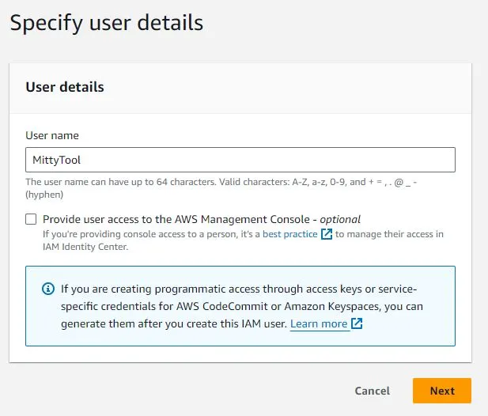</div>

The following **“Review and create”** page will simply display all the information about the user to you for final review. Make sure all is well and then hit the orange **“Create user“**.

<div style="text-align:center">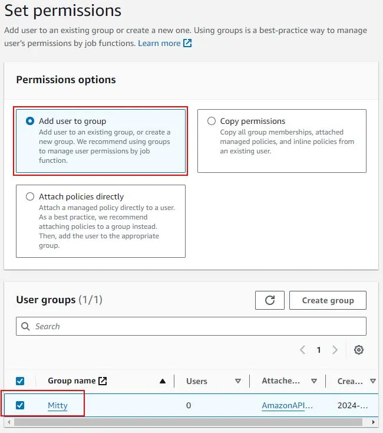</div>

You should now see the user appear under the **“Users”** section. Click on the user’s name to open their settings.

<div style="text-align:center">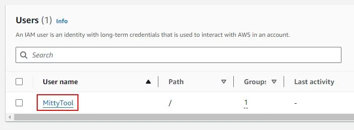</div>

Within the user section, you will see a tab titled **“Security credentials“**. Click on it and scroll down to a section titled **“Access keys“**. This section will have a button **“Create access key“**. Click on it to proceed.

<div style="text-align:center">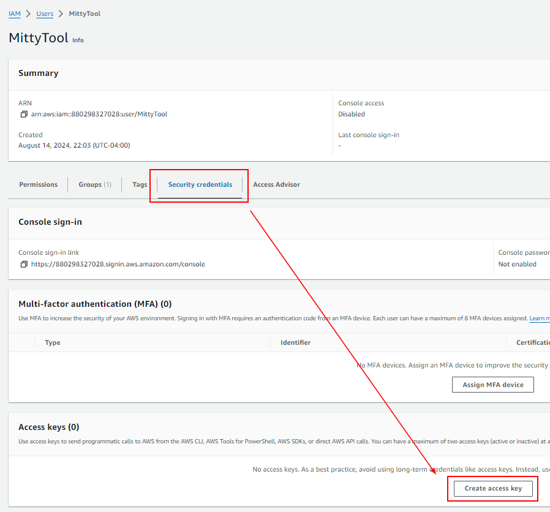</div>

For the **“Use case”** section, you can simply select **“Other”** and then hit the orange **“Next“**. Skip the **“Set description tag – optional”** section by clicking the orange **“Create access key“**. Doing so will take you to the **“Retrieve access keys”** section.

<br>
<div style="background-color: #F0C4B49C; padding: 5px; border-radius: 10px">
	<p style="color: #000000">
		<b style="color: #000000">THIS IS IMPORTANT! – SAVE YOUR ACCESS KEY THEN HIT “Show” AND COPY SAVE THE SECRET ACCESS KEY. IF YOU DID NOT SAVE THE SECRET ACCESS KEY, DELETE THE KEY YOU CREATED AND MAKE A NEW ONE.</b>
	</p>
</div>
<br>

<div style="text-align:center">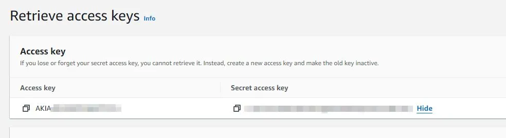</div>

And that’s it! You are ready to use Mitty with your newly created access keys!

<hr style="height: 2px">

## Revenge!

With Mitty in my toolbelt it was **TIME FOR REVENGE!!!**

I ran it against the CTF repo, and would you look at that? A repo tripped my word match of “flag”:

<div style="text-align:center">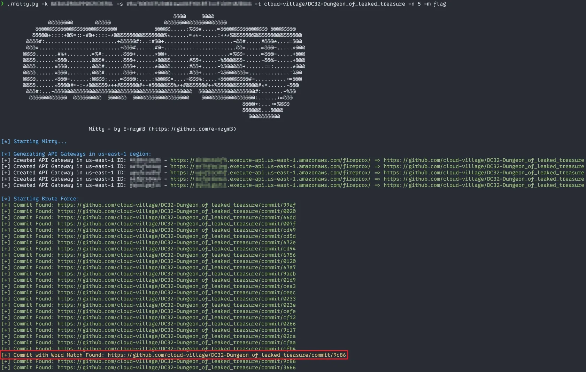</div>

And sure enough, there’s the flag!

<div style="text-align:center">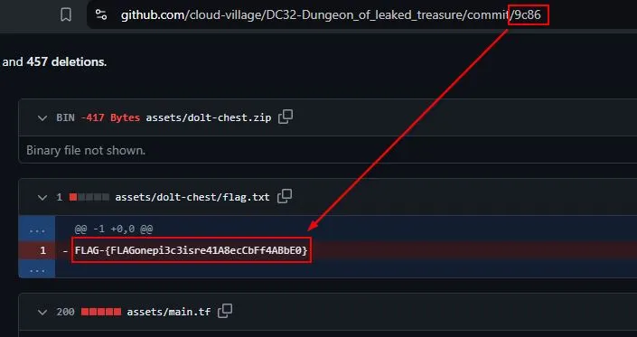</div>

If I had Mitty with me at the CTF, I would have solved this challenge in a matter of mintues… So moving forth, keep Mitty in mind. It will be useful not just for CTFs but also for enumerating public repositories for secrets, keys, passwords, and more!


**Thanks for stopping by! Please test Mitty out for me. Submit issue requests via Github for any errors you experience or any features you would like to see!**
