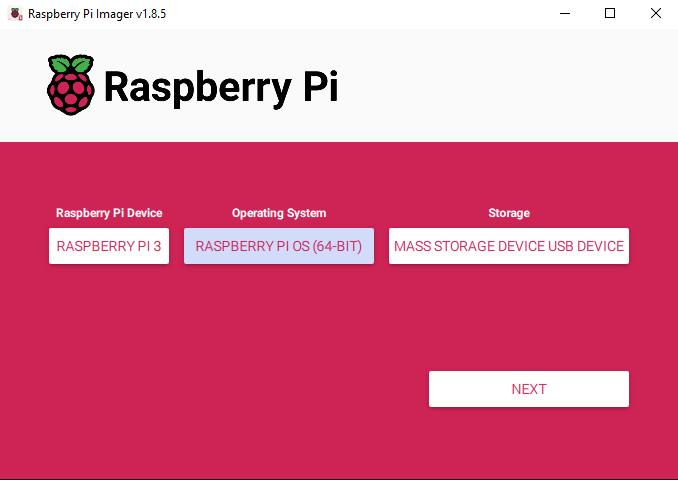

+++
title = "WarDriver Pi - Build Guide"
date = 2024-08-01T13:08:25-05:00
draft = false
+++

<h1 style="text-align:center">A Guide To Building Your Own WarDriving/WiFi Assessment Raspberry Pi</h1>

<div style="text-align:center"></div>


As penetration testers, we often have to travel onsite to perform various engagements. I recently was tasked with performing a wireless assessment for a client, but realized I did not want to walk around the client’s site with a laptop in hand, as that is just plain cumbersome. As such, I decided to put on my thinking hat, dust off some of the Raspberry Pi 3’s that I had laying around , and turn them into something useful that may just solve my immediate issue.

This build revolves around being user-friendly and easy to configure. As such, not much Linux knowledge is required to get this done. For access to our Pi, I am using RaspAP which sets up a WiFi access point on the Pi so that we can easily connect to it on the fly. **RaspAP** also makes management of the interfaces easy as it comes with a nice web UI hosted on port 80. For capture of WiFi networks, handshakes, and other fun data, I use **Kismet**. While on a normal WiFi engagement I would probably lean towards using the Aircrack-ng suite purely, this device serves a different purpose. It is not meant to be a full on handheld WiFi pentesting rig (although it can be with the use of an SSH client from your phone); it is more of an initial recon and handshake capture device.

*Maybe in the future I will incorporate some easy to use active methods for assessing networks (deauth attacks, evil twins, etc.).*

Let’s start off with the bill of materials:

* **Raspberry Pi** – this can be any Pi, I had two Pi 3’s not being used so that’s what I used
* **Micro SD card** – if you are planning on doing large captures, the bigger the better. I used 64gb and 32gb for my builds. You may also need a micro SD to USB adapter if you do not have one or if your card did not come with the micro SD to regular SD adapter which you can then plug into any regular SD card reader.
* **WiFi adapter** - one that supports monitor mode and packet injection – if you do not already have one, check out https://www.pandawireless.com/.
* **External battery bank** – I personally used [Anker Powercore 10,000](https://www.amazon.com/Anker-PowerCore-Ultra-Compact-High-Speed-Technology/dp/B0194WDVHI).
* **USB-A to Micro USB cable** to power your Pi from the power bank.
* OPTIONAL: **USB GPS receiver** – this is needed if you wish to also collect location data for each access point. Pretty much required if you’re planning on doing wardriving. Here’s one I used: [Amazon Link](https://www.amazon.com/Receiver-Antenna-Gmouse-Laptop-Navigation/dp/B073P3Y48Q).

<hr style="height: 2px">

## Raspberry Pi OS Installation

While this may be self-explanatory for some, I am going to cover how to get the Raspberry Pi OS onto the SD card so that we can have a functioning Pi.

First thing’s first, let’s download the Raspberry Pi Imager from the official source: https://www.raspberrypi.com/software/. Select the one appropriate for your OS, download it, install it, and launch it. Once you have it up, plug in your micro SD card via whatever means you have to your laptop/desktop running the imager. The imager will ask for three things:

1. **Raspberry Pi Device** – this will be the Pi version that you own and wish to use for this project. In my case it will be “Raspberry Pi 3”.
2. **Operating System** – more than likely this will remain as “Raspberry Pi OS (64-bit)” unless you are using some old hardware.
3. **Storage** – if your system detects the SD card you plugged in, you will likely only have one option to select here, unless you have multiple external drives plugged into your system. Select the one that contains the SD card. In my case: “Mass Storage Device USB Device”.

<div style="text-align:center"></div>

Once you hit “Next”, a customization window will appear. Do not skip past this as we have some things to configure here. Hit “Edit Settings” and a new window will pop open. Then, in General tab configure:

* **Set Hostname** – you can set this to anything you wish, “wardriver” in my case.
* **Set username and password** – self-explanatory, these will be the credentials to access your Pi
* **Configure wireless LAN** – configure this so that your Pi connects to your local WiFi network. This will be how we connect to it without the need for a montior, mouse, or keyboard. Select the appropriate country as well.
* **Set locale settings** – configure this to best match your current location.

Here’s what my configuration looks like:

<div style="text-align:center"></div>

Under the “Services” tab, simply **enable** the **SSH service with password authentication**. The rest of the settings can be left as default. Hit “Save” and proceed with the write process. Once the imager is done, it should eject your SD card from your system. At that point, feel free to remove it from the reader and insert it into your Raspberry Pi.

<hr style="height: 2px">

## Installing Software

At this point, we need to power the Pi. Use your powerbank or plug it into an available power source. Once the Pi boots up, it should connect to your local WiFi network (granted you configured the SSID and password correctly during the previous step). To find out if it is up, we have a few options. Either run a tool like Nmap across your entire WiFi network and look for port 22 (SSH) open on a device. If you find several, just try them all, it won’t hurt. Alternatively, refer to your wireless router’s network configuration to locate the Pi’s DHCP lease. I use UniFi equipment at home, so finding the Pi is as easy as browsing to the WiFi clients page and copying its IP address. Ultimately, if you are really struggling, plug in a monitor, keyboard, and mouse, open up terminal on the Pi and run **ifconfig**.

Once you get access to your Pi, update it first by running the following two commands to update packages:

```bash
sudo apt update
sudo apt upgrade
```

Now, let’s install Kismet. There are multiple ways of getting Kismet installed; however, some may be better than others. For instance, compiling Kismet from source on a Pi may not be a good idea as the Pi does not have sufficient resources to perform such RAM-heavy operations. Doing so may lock up your Pi forcing you to power cycle it. As such, the better route is to install it from packages made available by Kismet Wireless. To do so, we will need to add their repo to our Pi.

*As of 08/2024, the following instructions are still working, if you are doing this in 2-3 years from now, you may need to refer to Kismet’s documentation for current instructions (https://www.kismetwireless.net/packages/).*

Execute the following commands, in the order they are provided to install Kismet:

```
wget -O - https://www.kismetwireless.net/repos/kismet-release.gpg.key --quiet | gpg --dearmor | sudo tee /usr/share/keyrings/kismet-archive-keyring.gpg > /dev/null
echo 'deb [signed-by=/usr/share/keyrings/kismet-archive-keyring.gpg] https://www.kismetwireless.net/repos/apt/release/bookworm bookworm main' | sudo tee /etc/apt/sources.list.d/kismet.list > /dev/null
sudo apt update
sudo apt install kismet
```

<div style="text-align:center"></div>

*Note: Your output may slightly vary from what is in the screenshot, but as long as you reach the prompt to install Kismet, you are golden.*

**OPTIONAL**: If you are planning on using a GPS receiver with your setup, run the following commands to install the GPSd module:

```bash
sudo apt install gpsd gpsd-clients
```

<div style="text-align:center"></div>

To confirm whether your GPS receiver is working appropriately:

* Plug the receiver into the Pi
* Run the `dmesg | grep tty` command and check the most recent entry to confirm what your receiver is represented as on your system. In my case, it was ttyACM0:

<div style="text-align:center"></div>

* Then, run `gpsd /dev/<tty_module>` where `<tty_module>` is the name from the above command. In my case: `/dev/ttyACM0`. Once you execute this command, you will not see any output; however, to confirm that the receiver is now providing our GPSd daemon location data, we can run `gpsmon` and check if `LTP Pos:` values are showing a longitude and latitude value:

<div style="text-align:center"></div>

* If all is well, configure GPSd to start automatically on boot by running `sudo systemctl enable gpsd`. You can validate that the command took effect by running `service gpsd status` and referencing the highlighted line in the below screenshot:

<div style="text-align:center"></div>

Next we’ll install the absolutely necessary **Aircrack-ng** suite. This will give us access to the airmon-ng utility for placing our WiFi card into monitor mode. Also, the suite comes with other tools that we can use through SSH for carrying out WiFi deauthentication attacks, and more. To install the suite, simply run:

```bash
sudo apt install aircrack-ng
```

The last piece of the puzzle is to install **RaspAP** which will allow our Pi to programmatically create an access point for us to connect to upon boot. RaspAP comes with a nice web UI which is very user-friendly, and I’ll take easy over complicated any day! As of writing of this blog, the following command will install RaspAP on our Pi:

```bash
curl -sL https://install.raspap.com | bash
```

The installation script will ask you several questions, for most of which you can just accept the defaults by simply clicking the “enter” key when prompted. However, there were a few that I personally disabled as they were not required for my use case:

<div style="text-align:center"></div>

The RaspAP default configuration is as follows. Keep this handy as we will need it for initial access:

<div style="text-align:center"></div>
<br>
<div style="background-color: #F0C4B49C; padding: 5px; border-radius: 10px">
  <p style="color: #000000">
        <b style="color: #000000">IMPORTANT:</b> Before disconnecting from the Pi, we will want to ensure the Pi no longer connects to our pre-configured WiFi connection as we want to free up the wlan0 interface for RaspAP.
        <b style="color: #000000">!!! Once you execute the following two commands, you will lose connectivity to your Pi !!!</b>
        If you forgot something and need to get back on your Pi, you will have to plug in a monitor and keyboard.
  </p>
</div>

To prevent the Pi connecting to the WiFi which we have chosen when we installed Raspberry OS on the SD card, I recommend running the two following commands:

```bash
rm -rf /etc/wpa_supplicant/wpa_supplicant.conf
nmcli connection delete preconfigured
```

Your terminal will likely hang at this point as we just killed the connection to our WiFi. To force a reboot, simply unplug the Pi from power and plug it back in.

<hr style="height: 2px">

## Configuring The Pi

### RaspAP

You can plug your external WiFi adapter into the Pi now.

Once the Pi boots back up, look for a **raspi-webgui** WiFi network being broadcasted.

<div style="text-align:center"></div>

Once it’s up, connect to it. The default password will be **“ChangeMe“**.

*Note: if you’re on Windows, you may see the connection manager showing a spinning circle, almost making it seems like it is struggling to connect. That’s simply because this connection does not offer an Internet connection. Simply ignore that and proceed.*

To access the RaspAP web UI, open up your browser and browse to **http://10.3.141.1**. When prompted for credentials, use **“admin”** for user and **“secret”** for password.

<div style="text-align:center"></div>

After authenticating to the portal, let’s reconfigure the hotspot hosted by the Pi to make it more se-kurr.

*Note: The following configuration settings are purely based on preference, you do not have to select the same values as me, but just make sure to remember them for the future.*

Click on the **“Hotspot”** menu option on the left side to open up the config page. Then, under the **“Basic”** tab, re-name the SSID, **“wardriver2”** in my case as this is my second wardriving Pi.

<div style="text-align:center"></div>

Click **“Save settings”** just for good measure. Under the **“Security”** tab, update the pre-shared key (PSK) for the network.

<div style="text-align:center"></div>

**OPTIONAL**: Since I like to know things, especially when things start breaking and not working, under the **“Logging”** tab I recommend toggling the **“Logfile output”** setting.

<div style="text-align:center"></div>

Hit the **“Save settings”** button to solidify our hard work and make it law. No need to reboot anything just yet!

Now, I very much dislike the IP addressing scheme provided by the RaspAP default config, so I change it to something easier to remember. To do so, go to the **“DHCP Server”** menu option on the left side. You can make this whatever you would like. I chose to go with IP address of **172.16.0.1** for the Pi, **255.255.255.0** subnet mask, and default gateway same as the IP of the Pi.

<div style="text-align:center"></div>

By scrolling down a bit, under the **“DHCP options”** section, I changed the **“Starting IP Address”** and **“Ending IP Address”** fields to match our new IP address scheme.

<div style="text-align:center"></div>

Hit **“Save settings”** and we are good to go with that.

Lastly, let’s address the final piece of configuration: the login credentials. We can access the authentication settings by clicking on the **“admin”** with a person icon next to it, in the right upper corner of the app window. I changed my credentials to match those that I configured for access to the Pi, for simplicity sake.

<div style="text-align:center"></div>

Hit **“Save settings“**.

Now let’s test our config to make sure it works as expected. To reboot the Pi, click on the **“System”** menu option on the left side, then hit the **“Reboot”** button.

<div style="text-align:center"></div>

*Side Note: You can use the **“WiFi client”** menu to use the secondary WiFi interface for Internet connectivity for your Pi (in case you need to install other tools).*

Once the Pi reboots, it should now host a new AP based on the configurations we made. Connect to it and let’s configure Kismet next.

### Kismet

After connecting to the Pi’s AP, we can SSH back into it by using the IP address we assigned it earlier. In my case, it was **172.16.0.1**.

*Note: When you do this, you may run into an SSH error about **“remote host identification”** changing. Simply run the command that the error provides to remove the old host key, then SSH in again:*

<div style="text-align:center"></div>

After getting back onto the Pi via SSH, let’s create a centralized logging directory where Kismet will spit out all of our collected logs. I chose to simply create a **“logs”** directory on the Desktop. To do the same, run the following command (you may need to replace war with the name of the user you chose for logging into your Pi):

```bash
mkdir /home/war/Desktop/logs
```

To tell Kismet to save its logs to this newly created directory, we will have to edit the **/etc/kismet/kismet_logging.conf** file as root as the file resides within the protected **/etc** directory. You can use any text editor you want. If you’re unfamiliar, simply run:

```bash
sudo nano /etc/kismet/kismet_logging.conf
```

Within this configuration file, we want to edit the **log_prefix** value. It is pretty close to the top of the file, on line 31 in my case. Change it to the path of the logging folder we created earlier, **/home/war/Desktop/logs/** in my case. It should look like this:kismet_logging file

<div style="text-align:center"></div>

To save the file in **nano**, press **“CTRL + O”** then hit **“enter”** key. This will write the changes to the file. To quit **nano**, press **“CTRL + X”**.

Next we will configure the Kismet service to start on boot. We can achieve this by simply running:

```bash
sudo nano /etc/kismet/kismet_logging.conf
```

**OPTIONAL**: If you are going to be using the GPS receiver with Kismet through GPSd, then you will have to make one more modification to Kismet’s config. We need to configure Kismet to communicate with GPSd to pull coordinates. To do so, let’s edit the **/etc/kismet/kismet.conf** file.

```bash
sudo nano /etc/kismet/kismet.conf
```

Under the GPS configuration section, on line 194, there is a commented-out line for GPSd configuration. Simply remove the preceding **#** to apply the configuration. Should look as such:

<div style="text-align:center"></div>

To save the file in **nano**, press **“CTRL + O”** then hit **“enter”** key. This will write the changes to the file. To quit **nano**, press **“CTRL + X”**.

At this point, we are nearly done!! The last required modification is to add a way for our Pi to place the external WiFi card in monitor mode on boot.

### wlan1 Monitor Mode on Boot

Since placing the **wlan1** interface in monitor mode requires us to run commands (and we do not want to do that since we want this device to be pretty plug-and-play), we will have to implement a Bash script to handle this logic for us on each boot cycle. Lucky for you, I have already prepared a script specifically for this purpose: https://github.com/e-nzym3/wlan1mon-on-boot

If you have SSH still up and running, you can simply browse to https://raw.githubusercontent.com/e-nzym3/wlan1mon-on-boot/main/wlan1mon-on-boot.sh, copy the contents, and paste it into a new file called wlan1mon-on-boot.sh within /root/ directory. **You will need to perform this action as root.**

Here’s how to do it, in case you are new to Linux. Run:

```bash
sudo nano /root/wlan1mon-on-boot.sh
```

Paste the contents from the above link, **“SHIFT + CTRL + V”** is the shortcut.

<div style="background-color:#F0C4B49C; padding: 5px; border-radius: 10px">
    <p style="color: #000000"><b style="color: #000000">IMPORTANT</b>: If your local Pi user is not <b style="color: #000000">war</b> (as it is in my case), you will need to modify the script slightly as it uses a logging function to give us visibility in case things break and wlan1mon is not created. I highlighted in the screenshot below the line where you need to change war to whatever your username is.</p>
</div>
<br>
<div style="text-align:center"></div>

Then, just like before, press **“CTRL + O”** and then **“enter”** key to save. **“CTRL + X”** to exit. Before we move on, let’s make the file executable:

```bash
sudo chmod +x /root/wlan1mon-on-boot.sh
```

To have the script execute on each boot cycle, we will add an entry to **root** user’s crontab. Cron is simply a task scheduler for Linux. To edit root’s crontab, run:

```bash
sudo crontab -e
```

*Note: you may be prompted to select an editor for crontab. Select **nano** for simplicity sake.*

Within the crontab file, at the very bottom of it, add the following line:

```bash
@reboot /root/wlan1mon-on-boot.sh
```

To save the file in **nano**, press **“CTRL + O”** then hit **“enter”** key. This will write the changes to the file. To quit nano, press **“CTRL + X”**.

Reboot the Pi with `sudo reboot now`.

After the Pi reboots, connect back to its WiFi network. Now, try accessing the Kismet web UI through **http://172.16.0.1:2501**. The IP address will obviously differ if you applied different configuration during the RaspAP step. However, if you followed the guide verbatim, you should be welcomed by a Kismet interface and a prompt to create a new login. As before, I used the same credentials as for RaspAP and for logging into the Pi.

<div style="text-align:center"></div>

Once the portal loads, and if you are using the GPS receiver, you should be able to see the coordinates being displayed in the right upper corner of the app. The green crosshair icon confirms that a GPS lock is acquired:

<div style="text-align:center"></div>

To validate whether our monitor mode script executed successfully, we can proceed to the **“Data Sources”** menu which is accessible by clicking the hamburger icon in the left upper corner of the app, right next to the **“Kismet”** logo.

<div style="text-align:center"></div>
<br>
<div style="background-color: #C2F0B49C; padding: 5px; border-radius: 10px">
  <p style="color: #000000">
        If the script worked, you should see wlan1mon as an available interface. If you do, click on it and select <b style="color: #000000">“Enable source”</b> to start collecting WiFi data!
    </p>
</div>
<br>
<div style="background-color: #F0C4B49C; padding: 5px; border-radius: 10px">
  <p style="color: #000000">
        If wlan1mon is not listed. You can hop back onto the Pi and check the log file under <b style="color: #000000">/home/war/Desktop/wlan1_iface.log</b>. There should be output from <b style="color: #000000">airmon-ng</b> showing the <b style="color: #000000">wlan1</b> interface being enabled with monitor mode. If not, try running <b style="color: #000000">sudo airmon-ng start wlan1</b> manually to make sure the command actually works. I’ve found that I skipped the Aircrack-ng suite installation step in the past, which breaks the script as <b style="color: #000000">airmon-ng</b> will not be an available command.
    </p>
</div>
<br>

<hr style="height: 2px">

**Congrats!**

Now go out there and wardrive, or assess wireless networks. Kismet will save its logs to the logging directory we configured. So after each capture session, pull down the **.kismet** file from there and process it as needed. Maybe in the future I will write a short blog on what you can do with the file.

In the meantime, I would recommend checking out Hak5’s video on wardriving which covers some of the config we performed here as well: https://youtu.be/Z6h0vtqHxlQ?si=MuFAxVKX0Fo0YcbM. There are plenty of other videos and resources that talk about it too, including Kismet documentation: https://www.kismetwireless.net/docs/readme/kismetdb/kismetdb_to_pcap/.


**Thanks for stopping by and hacking with me! See you on the next one!**
